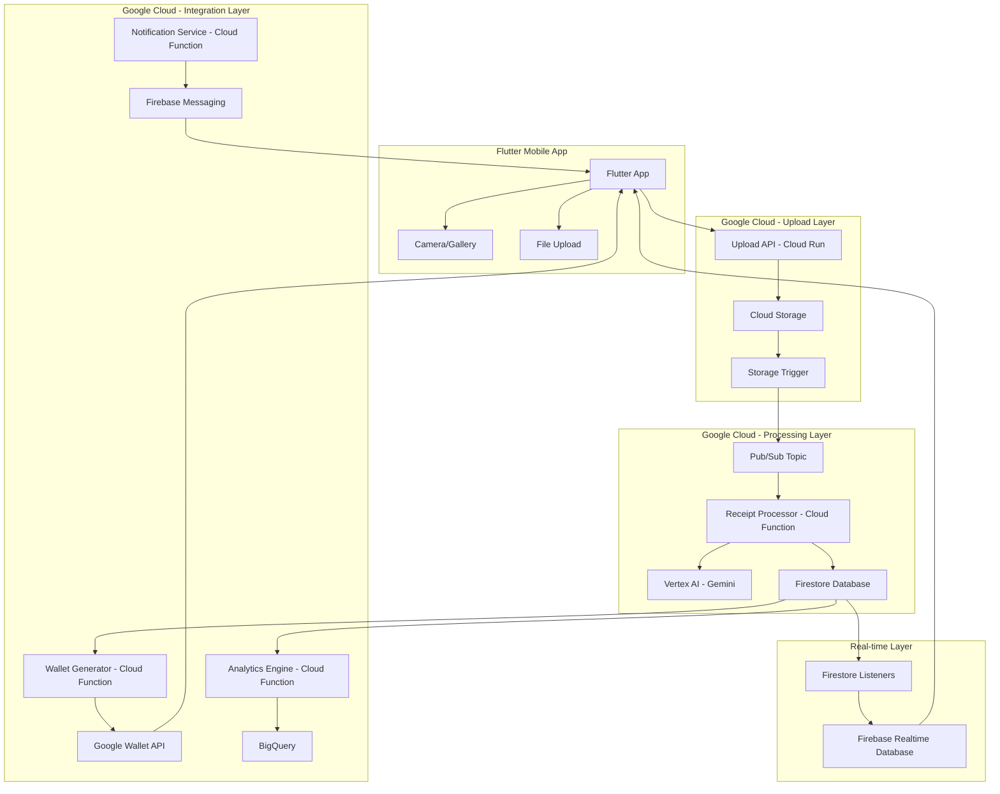

# Project Raseed - AI-Powered Receipt Management for Google Wallet

**Team:** Walletarium Imperium  
**Event:** Google Cloud Agentic AI Hackathon  
**Project:** Receipt Management System with AI Intelligence

## 📋 Table of Contents

- [Overview](#overview)
- [Architecture Overview](#architecture-overview)
- [Core Components](#core-components)
- [Technical Stack](#technical-stack)
- [API Design](#api-design)
- [Database Schema](#database-schema)
- [Security Strategy](#security-strategy)
- [Mobile Integration](#mobile-integration)
- [Scalability & Performance](#scalability--performance)
- [Implementation Roadmap](#implementation-roadmap)
- [Deployment Guide](#deployment-guide)

## 🎯 Overview

Project Raseed is an AI-powered personal assistant that revolutionizes receipt management and financial intelligence for Google Wallet. Built for the Google Cloud Agentic AI Hackathon, it transforms physical receipts into actionable financial insights through advanced multimodal AI processing.

### Key Features

- **🔍 Multimodal Receipt Processing**: Image, video, and live stream receipt analysis
- **🤖 AI-Powered Insights**: Gemini-based contextual financial intelligence  
- **💳 Google Wallet Integration**: Dynamic pass generation and updates
- **🌍 Multilingual Support**: Hindi, Tamil, Kannada, and other regional languages
- **🎮 Gamification**: Achievement system with persona-driven coaching
- **📊 Real-time Analytics**: Live spending tracking and budget management
- **🔄 Event-Driven Architecture**: Serverless, scalable cloud infrastructure

## 🏗️ Architecture Overview

### System Architecture Diagram



### Event-Driven Processing Flow

```
Flutter App → Cloud Storage → Storage Trigger → Pub/Sub → Processing Functions
```

```
Receipt Upload → OCR Processing → Data Extraction → Wallet Pass Creation → User Notification
```

## 🧩 Core Components

### 1. Event-Driven Processing with Pub/Sub

**Pub/Sub Topics Structure:**
```yaml
Topics:
  - receipt-uploaded        # Triggered on new receipt upload
  - receipt-processed       # After Gemini OCR completion  
  - wallet-pass-ready      # When pass is generated
  - analytics-update       # For spending insights
  - notification-send      # For push notifications
```

**Core Event Flow:**
```typescript
// Cloud Function: Receipt Upload Trigger
exports.receiptUploadTrigger = functions.storage.object().onFinalize(async (object) => {
  const message = {
    receiptId: generateReceiptId(),
    filePath: object.name,
    userId: extractUserFromPath(object.name),
    timestamp: new Date().toISOString(),
    fileSize: object.size,
    contentType: object.contentType
  };
  
  await pubsub.topic('receipt-uploaded').publishJSON(message);
});
```

### 2. Google Cloud Storage Integration

**Bucket Structure:**
```yaml
Primary Bucket: receipts-staging-bucket
Structure:
  /users/{userId}/
    /receipts/
      /{year}/{month}/
        /original/     # Original uploaded files
        /processed/    # Processed/optimized images
        /thumbnails/   # Generated thumbnails
    /videos/          # Video uploads (if supported)
    /temp/            # Temporary processing files
```

**Signed URL Generation for Secure Uploads:**
```typescript
// Cloud Function: generateUploadURL
export const generateUploadURL = functions.https.onCall(async (data, context) => {
  const { userId, fileType, fileSize } = data;
  
  // Validate user authentication
  if (!context.auth) {
    throw new functions.https.HttpsError('unauthenticated', 'User not authenticated');
  }
  
  // Generate unique filename
  const timestamp = Date.now();
  const randomId = generateRandomString(8);
  const filename = `users/${userId}/receipts/${new Date().getFullYear()}/${new Date().getMonth() + 1}/original/receipt_${timestamp}_${userId}_${randomId}.${fileType}`;
  
  // Create signed URL for upload
  const [signedUrl] = await storage.bucket('receipts-staging-bucket').file(filename).getSignedUrl({
    version: 'v4',
    action: 'write',
    expires: Date.now() + 15 * 60 * 1000, // 15 minutes
    contentType: getMimeType(fileType),
    conditions: [
      ['content-length-range', 0, 10 * 1024 * 1024] // Max 10MB
    ]
  });
  
  return {
    uploadUrl: signedUrl,
    filePath: filename,
    receiptId: `receipt_${timestamp}_${randomId}`
  };
});
```

### 3. Vertex AI Integration for Gemini Processing

**Enhanced Receipt Processing:**
```typescript
// Cloud Function: Advanced Receipt Processor
export const processReceiptWithVertexAI = functions.pubsub.topic('receipt-uploaded').onPublish(async (message) => {
  const { receiptId, userId, filePath } = message.json;
  
  try {
    // Download image from Cloud Storage
    const imageBuffer = await downloadImageFromStorage(filePath);
    
    // Initialize Vertex AI model
    const model = vertex_ai.preview.getGenerativeModel({
      model: 'gemini-2.5-flash-002',
      generationConfig: {
        maxOutputTokens: 8192,
        temperature: 0.1, // Low temperature for accuracy
        topP: 0.8
      }
    });
    
    // Enhanced prompt for comprehensive extraction
    const structuredPrompt = `
    You are an expert receipt analysis AI. Analyze this receipt image and extract ALL information in the following JSON structure.
    
    IMPORTANT REQUIREMENTS:
    1. Extract EVERY visible item with precise pricing
    2. Detect store loyalty programs, discounts, and offers
    3. Identify subscription services or recurring charges
    4. Determine warranty information from item descriptions
    5. Categorize items using these categories: ${ITEM_CATEGORIES.join(', ')}
    6. Support multiple languages (Hindi, Tamil, Kannada, etc.)
    7. Calculate confidence scores for each extracted field
    
    Output Format: [Detailed JSON structure for receipt data]
    `;
    
    // Process with Vertex AI
    const result = await model.generateContent([
      { text: structuredPrompt },
      { inlineData: { mimeType: 'image/jpeg', data: imageBuffer.toString('base64') }}
    ]);
    
    const extractedData = parseGeminiResponse(result.response.text());
    
    // Enhanced data with AI insights
    const enhancedData = await enrichWithAI(extractedData, userId);
    
    // Save to Firestore with confidence tracking
    await saveReceiptWithConfidence(receiptId, enhancedData);
    
    // Trigger downstream processes
    await triggerWalletGeneration(receiptId, enhancedData);
    await triggerAnalyticsUpdate(userId, enhancedData);
    
  } catch (error) {
    await handleProcessingError(receiptId, error);
  }
});
```

**Multilingual & Video Support:**
```typescript
// Language Detection & Processing
const SUPPORTED_LANGUAGES = {
  'en': 'English',
  'hi': 'Hindi', 
  'ta': 'Tamil',
  'kn': 'Kannada',
  'te': 'Telugu',
  'mr': 'Marathi',
  'bn': 'Bengali',
  'gu': 'Gujarati'
};

// Video Frame Extraction for Receipt Processing
export const processReceiptVideo = functions.pubsub.topic('video-uploaded').onPublish(async (message) => {
  const { videoPath, userId, receiptId } = message.json;
  
  // Extract frames using Cloud Video AI
  const videoClient = new VideoIntelligenceServiceClient();
  
  const request = {
    inputUri: `gs://receipts-staging-bucket/${videoPath}`,
    features: ['SHOT_CHANGE_DETECTION', 'TEXT_DETECTION'],
    videoContext: {
      textDetectionConfig: {
        languageHints: ['en', 'hi', 'ta', 'kn'] // Multi-language support
      }
    }
  };
  
  // Process selected frame with Gemini
  const bestFrame = await selectBestReceiptFrame(operationResult);
  return await processReceiptWithVertexAI({ json: { receiptId, userId, filePath: bestFrame.frameImagePath }});
});
```

### 4. Google Wallet API Integration

**Pass Types for Project Raseed:**
```typescript
enum PassType {
  RECEIPT_SUMMARY = 'receipt-summary',      // Individual receipt details
  SPENDING_INSIGHTS = 'spending-insights',  // Monthly/weekly spending analysis  
  SHOPPING_LIST = 'shopping-list',          // AI-generated shopping lists
  ACHIEVEMENT_BADGE = 'achievement-badge',  // Gamification badges
  SAVINGS_GOAL = 'savings-goal',           // Progress towards savings targets
  SUBSCRIPTION_REMINDER = 'subscription'    // Recurring payment alerts
}
```

**Wallet Pass Service:**
```typescript
class WalletPassService {
  async createReceiptPass(receiptData: any, userId: string): Promise<string> {
    const classId = `${this.issuerId}.receipt_class`;
    const objectId = `${this.issuerId}.receipt_${receiptData.receiptId}`;
    
    const passObject = {
      id: objectId,
      classId: classId,
      state: 'ACTIVE',
      textModulesData: [
        {
          id: 'store-info',
          header: 'Store Information',
          body: `${receiptData.store_info.name}\n${receiptData.store_info.date} ${receiptData.store_info.time}`
        },
        {
          id: 'total-amount',
          header: 'Total Amount',
          body: `₹${receiptData.totals.total.toFixed(2)}`
        },
        {
          id: 'items-count',
          header: 'Items Purchased',
          body: `${receiptData.items.length} items`
        }
      ],
      linksModuleData: {
        uris: [
          {
            uri: `https://raseed-app.com/receipt/${receiptData.receiptId}`,
            description: 'View Full Receipt Details',
            id: 'view-receipt'
          },
          {
            uri: `https://raseed-app.com/chat?receipt=${receiptData.receiptId}`,
            description: 'Ask AI About This Purchase',
            id: 'ai-chat'
          }
        ]
      },
      barcode: {
        type: 'QR_CODE',
        value: receiptData.receiptId,
        alternateText: receiptData.receiptId
      }
    };
    
    return await this.insertPass(passObject);
  }
}
```

## 🚀 Technical Stack

### Google Cloud Services
- **Vertex AI**: Gemini 2.5 Flash for multimodal processing
- **Cloud Functions**: Event-driven serverless computing
- **Cloud Run**: API services and microservices
- **Cloud Storage**: Receipt image and video storage
- **Pub/Sub**: Event-driven messaging
- **Firestore**: NoSQL database for structured data
- **BigQuery**: Analytics and data warehousing
- **Cloud Video AI**: Video frame extraction
- **Identity & Access Management**: Security and authentication

### Firebase Services
- **Realtime Database**: Live updates and notifications
- **Cloud Messaging**: Push notifications
- **Authentication**: User management
- **Dynamic Links**: Deep linking for wallet passes
- **Remote Config**: Feature flags and A/B testing

### Additional Technologies
- **Flutter**: Cross-platform mobile development
- **Google Wallet API**: Pass generation and management
- **Model Context Protocol (MCP)**: Structured data exchange

## 📡 API Design

### Core API Endpoints

**Receipt Processing APIs:**
```typescript
// POST /api/receipts - Create/Parse Receipt
interface ReceiptUploadRequest {
  imageBase64: string;
  userId: string;
  metadata?: {
    source: 'mobile_camera' | 'gallery' | 'video_frame';
    location?: { lat: number, lng: number };
    timestamp?: string;
  };
}

interface ReceiptUploadResponse {
  receiptId: string;
  parsedItems: ReceiptItem[];
  status: 'processing' | 'completed' | 'error';
  processingUrl?: string; // WebSocket for real-time updates
}
```

**Free-form Text Processing:**
```typescript
// POST /api/parse - Free-form to Structured Parsing
interface ParseTextRequest {
  rawText: string;
  userId: string;
  language?: string; // For multilingual support
}

interface ParseTextResponse {
  items: ReceiptItem[];
  confidence: 'high' | 'medium' | 'low';
  suggestions: string[]; // AI suggestions for missing fields
}
```

**Receipt Management:**
```typescript
// PUT /api/receipts/{receiptId} - Update Receipt
interface UpdateReceiptRequest {
  parsedItems: ReceiptItem[];
  subscription?: SubscriptionDetails;
  warrantyDetails?: WarrantyDetails;
  userCorrections?: UserCorrection[];
}
```

**Structured Data Models:**
```typescript
interface ReceiptItem {
  place: string;                    // Required
  category?: string;                // Optional
  description?: string;             // Optional  
  time: string;                     // ISO 8601 (Required)
  amount: number;                   // Required
  transactionType: 'credit' | 'debit'; // Required
  importance?: 'low' | 'medium' | 'high'; // Optional
  warranty?: boolean;               // Optional
  recurring?: boolean;              // Optional
}

interface SubscriptionDetails {
  name: string;
  recurrence: 'weekly' | 'monthly' | 'yearly';
  nextDueDate: string; // ISO date
}

interface WarrantyDetails {
  validUntil: string;  // ISO date
  provider?: string;
  termsURL?: string;
}
```

## 🗄️ Database Schema

### Firestore Collections Structure

**Users Collection:**
```typescript
interface UserProfile {
  userId: string;
  email: string;
  displayName?: string;
  
  preferences: {
    currency: 'INR' | 'USD' | 'EUR';
    language: 'en' | 'hi' | 'ta' | 'kn';
    timezone: string;
    categories: string[];
    defaultBudget: {
      monthly: number;
      categoryLimits: Record<string, number>;
    };
  };
  
  persona: {
    type: 'student' | 'freelancer' | 'employee' | 'homemaker' | 'business';
    goals: string[];
    riskTolerance: 'conservative' | 'moderate' | 'aggressive';
  };
  
  gamification: {
    level: number;
    xp: number;
    currentStreak: number;
    totalReceiptsScanned: number;
    badges: string[];
    achievements: string[];
  };
  
  createdAt: Timestamp;
  accountStatus: 'active' | 'inactive' | 'suspended';
}
```

**Receipts Collection:**
```typescript
interface Receipt {
  receiptId: string;
  userId: string;
  
  processingStatus: 'uploaded' | 'processing' | 'completed' | 'failed';
  confidenceScore: number; // 0-100
  
  storeInfo: {
    name: string;
    address?: string;
    transactionDate: Timestamp;
    receiptNumber?: string;
    location?: { latitude: number; longitude: number };
  };
  
  items: Array<{
    itemId: string;
    name: string;
    quantity: number;
    unitPrice: number;
    totalPrice: number;
    category: string;
    importance: 'low' | 'medium' | 'high';
    warrantyImplied: boolean;
    subscriptionIndicator: boolean;
  }>;
  
  totals: {
    subtotal: number;
    tax: number;
    total: number;
    paymentMethod: 'cash' | 'card' | 'digital' | 'mixed';
  };
  
  aiInsights: {
    budgetImpact: 'minimal' | 'moderate' | 'significant';
    spendingPattern: 'regular' | 'unusual' | 'first_time';
    recommendations: string[];
    alternativeSuggestions: Array<{
      category: string;
      suggestion: string;
      potentialSaving: number;
    }>;
  };
  
  files: {
    originalImage: string;
    processedImage?: string;
    thumbnail?: string;
  };
  
  createdAt: Timestamp;
  updatedAt: Timestamp;
}
```

**Analytics Collection:**
```typescript
interface MonthlyAnalytics {
  userId: string;
  month: string; // "2025-07"
  
  totalSpent: number;
  totalReceipts: number;
  averagePerReceipt: number;
  
  categorySpending: Record<string, {
    amount: number;
    count: number;
    percentage: number;
    trend: number; // vs previous month
  }>;
  
  topStores: Array<{
    name: string;
    amount: number;
    visits: number;
  }>;
  
  budgetComparison: {
    budgetSet: number;
    actualSpent: number;
    variance: number;
  };
  
  aiInsights: {
    spendingTrend: 'increasing' | 'decreasing' | 'stable';
    trendPercentage: number;
    keyInsights: string[];
    recommendations: string[];
  };
}
```

### Required Firestore Indexes

```typescript
const REQUIRED_INDEXES = [
  // Receipt queries
  { collection: 'receipts', fields: ['userId', 'createdAt', 'desc'] },
  { collection: 'receipts', fields: ['userId', 'storeInfo.name', 'createdAt', 'desc'] },
  { collection: 'receipts', fields: ['userId', 'processingStatus'] },
  
  // Analytics queries
  { collection: 'analytics', fields: ['userId', 'month', 'desc'] },
  
  // Subscription queries  
  { collection: 'subscriptions', fields: ['userId', 'isActive', 'nextBillingDate'] },
];
```

## 🔒 Security Strategy

### Authentication & Authorization

**Firebase Authentication Integration:**
```typescript
// Multi-provider authentication
const authProviders = {
  google: new GoogleAuthProvider(),
  phone: new PhoneAuthProvider(), 
  apple: new OAuthProvider('apple.com')
};

// Custom claims for role-based access
const userRoles = {
  'user': ['read:own_receipts', 'write:own_receipts'],
  'premium': ['read:own_receipts', 'write:own_receipts', 'access:advanced_analytics'],
  'admin': ['read:all', 'write:all', 'manage:users']
};
```

**API Security:**
```typescript
// Cloud Function middleware for authentication
const authenticate = async (req: Request, res: Response, next: NextFunction) => {
  try {
    const token = req.headers.authorization?.split('Bearer ')[1];
    if (!token) throw new Error('No token provided');
    
    const decodedToken = await admin.auth().verifyIdToken(token);
    req.user = decodedToken;
    next();
  } catch (error) {
    res.status(401).json({ error: 'Unauthorized' });
  }
};
```

**Data Privacy & Compliance:**
```yaml
Privacy Measures:
  - End-to-end encryption for sensitive data
  - GDPR compliance with data deletion rights
  - PII anonymization in analytics
  - Secure API key management with Secret Manager
  - Regular security audits and penetration testing
  
Access Controls:
  - User-level data isolation in Firestore security rules
  - IAM roles with principle of least privilege
  - VPC network security for internal communications
  - Cloud Armor for DDoS protection
```

**Firestore Security Rules:**
```javascript
rules_version = '2';
service cloud.firestore {
  match /databases/{database}/documents {
    // Users can only access their own data
    match /receipts/{receiptId} {
      allow read, write: if request.auth != null 
        && request.auth.uid == resource.data.userId;
    }
    
    match /users/{userId} {
      allow read, write: if request.auth != null 
        && request.auth.uid == userId;
    }
    
    match /analytics/{userId}/{document=**} {
      allow read: if request.auth != null 
        && request.auth.uid == userId;
    }
  }
}
```

## 📱 Mobile Integration

### Flutter Architecture

**Service Architecture:**
```dart
// Flutter service architecture
class AppServices {
  static final ReceiptUploadService uploadService = ReceiptUploadService();
  static final RealTimeUpdateService realTimeService = RealTimeUpdateService();
  static final WalletIntegrationService walletService = WalletIntegrationService();
  static final AnalyticsService analyticsService = AnalyticsService();
  static final AIAssistantService aiService = AIAssistantService();
}

// Receipt Upload Service
class ReceiptUploadService {
  Future<String> uploadReceipt(File imageFile, String userId) async {
    // Step 1: Get signed URL
    final callable = FirebaseFunctions.instance.httpsCallable('generateUploadURL');
    final result = await callable.call({
      'userId': userId,
      'fileType': 'jpg',
      'fileSize': await imageFile.length()
    });
    
    // Step 2: Upload to Cloud Storage
    final uploadUrl = result.data['uploadUrl'];
    final response = await http.put(
      Uri.parse(uploadUrl),
      body: await imageFile.readAsBytes(),
      headers: {'Content-Type': 'image/jpeg'}
    );
    
    if (response.statusCode == 200) {
      return result.data['receiptId'];
    }
    throw Exception('Upload failed');
  }
}
```

**Real-time Updates:**
```dart
// Flutter Widget: Real-time Processing Indicator
class ReceiptProcessingWidget extends StatelessWidget {
  final String receiptId;
  
  @override
  Widget build(BuildContext context) {
    return StreamBuilder<ProcessingStatus>(
      stream: RealTimeUpdateService().listenToReceiptProcessing(receiptId),
      builder: (context, snapshot) {
        if (!snapshot.hasData) return const CircularProgressIndicator();
        
        final status = snapshot.data!;
        return Card(
          child: Column(
            children: [
              LinearProgressIndicator(value: status.progress / 100),
              Text('${status.stage.toUpperCase()}: ${status.progress.toInt()}%'),
              if (status.error != null)
                Text(status.error!, style: TextStyle(color: Colors.red)),
            ],
          ),
        );
      },
    );
  }
}
```

**Camera Integration:**
```dart
// Camera service for receipt capture
class CameraService {
  static final CameraController _controller = CameraController(
    CameraLensDirection.back, 
    ResolutionPreset.high
  );
  
  static Future<File> captureReceipt() async {
    await _controller.initialize();
    final XFile photo = await _controller.takePicture();
    return File(photo.path);
  }
  
  // Auto-detection and enhancement
  static Future<File> captureWithAutoDetection() async {
    // Implement real-time receipt detection using ML Kit
    // Provide visual feedback to user for optimal positioning
    // Auto-capture when receipt is properly framed
  }
}
```

### State Management

**BLoC Pattern Implementation:**
```dart
// Receipt processing BLoC
class ReceiptProcessingBloc extends Bloc<ReceiptEvent, ReceiptState> {
  final ReceiptUploadService _uploadService;
  final RealTimeUpdateService _realTimeService;
  
  ReceiptProcessingBloc(this._uploadService, this._realTimeService) 
    : super(ReceiptInitial()) {
    on<UploadReceiptEvent>(_onUploadReceipt);
    on<ProcessingUpdateEvent>(_onProcessingUpdate);
  }
  
  void _onUploadReceipt(UploadReceiptEvent event, Emitter<ReceiptState> emit) async {
    emit(ReceiptUploading());
    
    try {
      final receiptId = await _uploadService.uploadReceipt(event.imageFile, event.userId);
      
      // Listen to real-time updates
      _realTimeService.listenToReceiptProcessing(receiptId).listen((status) {
        add(ProcessingUpdateEvent(status));
      });
      
      emit(ReceiptProcessing(receiptId));
    } catch (error) {
      emit(ReceiptError(error.toString()));
    }
  }
}
```

## ⚡ Scalability & Performance

### Auto-scaling Configuration

**Cloud Functions Scaling:**
```yaml
Cloud Functions Config:
  - Receipt Processor:
      min_instances: 2
      max_instances: 100
      memory: 2GB
      timeout: 540s
      concurrency: 10
  
  - Wallet Generator:
      min_instances: 1  
      max_instances: 50
      memory: 1GB
      timeout: 180s
      concurrency: 20
```

**Cloud Run Scaling:**
```yaml
API Services:
  - receipt-api-service:
      min_instances: 2
      max_instances: 100
      cpu: 2
      memory: 4Gi
      request_timeout: 300s
      
  - analytics-service:
      min_instances: 1
      max_instances: 50  
      cpu: 1
      memory: 2Gi
```

### Performance Optimizations

**Caching Strategy:**
```typescript
// Redis caching for frequent queries
const cacheConfig = {
  userAnalytics: { ttl: '1h' },      // User analytics cache
  receiptMetadata: { ttl: '24h' },   // Receipt metadata cache  
  storeInfo: { ttl: '7d' },          // Store information cache
  aiInsights: { ttl: '1h' }          // AI-generated insights cache
};

// Firestore query optimization
const optimizedQueries = {
  // Use composite indexes for complex queries
  userReceipts: firestore.collection('receipts')
    .where('userId', '==', userId)
    .orderBy('createdAt', 'desc')
    .limit(20),
    
  // Pagination for large datasets
  paginatedAnalytics: firestore.collection('analytics')
    .where('userId', '==', userId)
    .orderBy('month', 'desc')
    .startAfter(lastDocument)
    .limit(10)
};
```

**Cost Optimization:**
```yaml
Storage Lifecycle:
  - Original Images: Standard → Nearline (30d) → Coldline (90d) → Archive (1y)
  - Processed Images: Standard (7d) → Nearline
  - Temporary Files: Auto-delete (1d)
  
Function Optimization:
  - Use appropriate memory allocation
  - Implement connection pooling
  - Optimize cold start times
  - Use Cloud Scheduler for batch processing
  
Database Optimization:
  - Strategic indexing
  - Query result caching
  - Data archiving for old records
  - Firestore bundling for mobile apps
```

### Monitoring & Observability

**Logging & Monitoring:**
```typescript
// Structured logging
const logger = new Logger('raseed-backend');

logger.info('Receipt processing started', {
  receiptId,
  userId, 
  timestamp: Date.now(),
  metadata: { fileSize, processingStage: 'ocr' }
});

// Custom metrics
const metrics = {
  receiptProcessingTime: histogram('receipt_processing_duration_seconds'),
  walletPassGeneration: counter('wallet_passes_generated_total'),
  userEngagement: gauge('active_users_current'),
  errorRate: rate('processing_errors_per_minute')
};
```

**Health Checks:**
```typescript
// Health check endpoint
app.get('/health', async (req, res) => {
  const healthStatus = {
    timestamp: new Date().toISOString(),
    services: {
      firestore: await checkFirestoreHealth(),
      storage: await checkStorageHealth(),
      vertexAI: await checkVertexAIHealth(),
      walletAPI: await checkWalletAPIHealth()
    },
    metrics: {
      processingQueueSize: await getProcessingQueueSize(),
      avgProcessingTime: await getAvgProcessingTime()
    }
  };
  
  const allHealthy = Object.values(healthStatus.services).every(s => s === 'healthy');
  res.status(allHealthy ? 200 : 503).json(healthStatus);
});
```

## 📱 Firebase Real-time Integration

### Real-time Database Structure

```typescript
interface RealtimeSchema {
  users: {
    [userId: string]: {
      processing: {
        [receiptId: string]: {
          status: 'uploading' | 'processing' | 'completed' | 'failed';
          progress: number; // 0-100
          stage: 'upload' | 'ocr' | 'analysis' | 'wallet_creation';
          startedAt: number;
          error?: string;
        };
      };
      
      analytics: {
        todaySpending: number;
        monthlySpending: number;
        streak: number;
        level: number;
        xp: number;
        newBadges: string[];
      };
      
      notifications: {
        [notificationId: string]: {
          type: 'receipt_processed' | 'budget_alert' | 'achievement';
          title: string;
          body: string;
          timestamp: number;
          read: boolean;
        };
      };
    };
  };
}
```

### Push Notifications

```typescript
// Smart notification service
export const sendSmartNotification = functions.firestore
  .document('users/{userId}/analytics/{analyticsId}')
  .onUpdate(async (change, context) => {
    const userId = context.params.userId;
    const newData = change.after.data();
    const oldData = change.before.data();
    
    // Budget alert logic
    if (newData.monthlySpending > newData.budgetLimit * 0.8 && 
        oldData.monthlySpending <= oldData.budgetLimit * 0.8) {
      
      await admin.messaging().sendToTopic(`user_${userId}`, {
        notification: {
          title: '⚠️ Budget Alert',
          body: `You've spent 80% of your monthly budget (₹${newData.monthlySpending.toFixed(2)})`
        },
        data: {
          type: 'budget_warning',
          action: 'open_analytics'
        }
      });
    }
  });
```

## 🚀 Implementation Roadmap

### Phase 1: Core Infrastructure (Week 1)
- [ ] Set up Google Cloud project and enable required APIs
- [ ] Configure Firestore database and security rules
- [ ] Implement basic authentication with Firebase Auth
- [ ] Create Cloud Storage buckets and lifecycle policies
- [ ] Set up Pub/Sub topics and subscriptions

### Phase 2: Receipt Processing (Week 2)  
- [ ] Implement Vertex AI integration for Gemini processing
- [ ] Create receipt upload and processing pipeline
- [ ] Build Cloud Functions for event-driven processing
- [ ] Implement error handling and retry mechanisms
- [ ] Add support for multiple image formats

### Phase 3: Mobile App Development (Week 3)
- [ ] Create Flutter app with camera integration
- [ ] Implement real-time status updates
- [ ] Build user interface for receipt management
- [ ] Add offline capability and sync
- [ ] Integrate push notifications

### Phase 4: Google Wallet Integration (Week 4)
- [ ] Set up Google Wallet API credentials
- [ ] Implement pass generation and management
- [ ] Create dynamic pass updates
- [ ] Add deep linking support
- [ ] Test wallet pass functionality

### Phase 5: AI Features & Analytics (Week 5)
- [ ] Implement AI-powered insights generation
- [ ] Build analytics dashboard
- [ ] Add subscription detection
- [ ] Create personalized recommendations
- [ ] Implement gamification features

### Phase 6: Testing & Optimization (Week 6)
- [ ] Comprehensive testing (unit, integration, e2e)
- [ ] Performance optimization and caching
- [ ] Security audit and penetration testing
- [ ] Load testing and scalability validation
- [ ] Documentation and deployment guides

## 🔧 Deployment Guide

### Prerequisites

1. **Google Cloud Setup:**
   ```bash
   gcloud auth login
   gcloud config set project your-project-id
   gcloud services enable \
     storage.googleapis.com \
     firestore.googleapis.com \
     cloudfunctions.googleapis.com \
     run.googleapis.com \
     aiplatform.googleapis.com \
     pubsub.googleapis.com
   ```

2. **Firebase Setup:**
   ```bash
   npm install -g firebase-tools
   firebase login
   firebase init
   ```

### Deployment Steps

1. **Deploy Cloud Functions:**
   ```bash
   firebase deploy --only functions
   ```

2. **Deploy Cloud Run Services:**
   ```bash
   gcloud run deploy receipt-api-service \
     --source . \
     --region us-central1 \
     --allow-unauthenticated
   ```

3. **Configure Firestore:**
   ```bash
   firebase deploy --only firestore
   ```

4. **Set up monitoring:**
   ```bash
   gcloud logging sinks create raseed-sink \
     bigquery.googleapis.com/projects/your-project/datasets/logs
   ```

### Environment Configuration

```yaml
# .env.production
GOOGLE_CLOUD_PROJECT=your-project-id
FIRESTORE_EMULATOR_HOST=localhost:8080
STORAGE_EMULATOR_HOST=localhost:9199
PUBSUB_EMULATOR_HOST=localhost:8085

# Vertex AI
VERTEX_AI_LOCATION=us-central1
GEMINI_MODEL=gemini-2.5-flash-002

# Google Wallet
GOOGLE_WALLET_ISSUER_ID=your-issuer-id
GOOGLE_WALLET_AUDIENCE=your-audience

# Firebase
FIREBASE_PROJECT_ID=your-firebase-project
```

## 🧪 Manual Testing & Development

### Testing Pipeline Without Frontend

The event-driven architecture allows you to test the entire processing pipeline by manually uploading files to Cloud Storage. The system will automatically detect uploads and trigger the complete processing flow.

#### **1. Manual Upload via gcloud CLI:**

```bash
# Upload a receipt image manually to trigger the pipeline
gsutil cp receipt-sample.jpg gs://receipts-staging-bucket/users/test-user-123/receipts/2025/07/original/

# The system will automatically:
# 1. Detect the upload via Storage Trigger
# 2. Extract userId from path: 'test-user-123'
# 3. Generate receiptId and publish to Pub/Sub
# 4. Process with Vertex AI Gemini
# 5. Save results to Firestore
# 6. Generate Google Wallet pass
# 7. Send notifications
```

#### **2. Required File Path Structure:**

```yaml
# Critical: Follow this exact path structure for automatic processing
Path Format: /users/{userId}/receipts/{year}/{month}/original/{filename}

Examples:
✅ CORRECT: users/test-user-123/receipts/2025/07/original/receipt_001.jpg
✅ CORRECT: users/demo-user/receipts/2025/07/original/my-receipt.png
❌ WRONG: receipts/receipt.jpg (missing user structure)
❌ WRONG: users/test-user/receipt.jpg (missing year/month/original)
```

#### **3. Batch Testing Script:**

```bash
#!/bin/bash
# test-pipeline.sh - Batch upload multiple receipts for testing

USER_ID="test-user-123"
BUCKET="receipts-staging-bucket"
YEAR=$(date +%Y)
MONTH=$(date +%m)

# Upload multiple test receipts
for i in {1..5}; do
  echo "Uploading test receipt $i..."
  gsutil cp "test-receipts/receipt_$i.jpg" \
    "gs://$BUCKET/users/$USER_ID/receipts/$YEAR/$MONTH/original/test_receipt_$(date +%s)_$i.jpg"
  
  echo "Uploaded - Processing should start automatically..."
  sleep 2
done

echo "All test receipts uploaded! Check Firestore and logs for processing results."
```

#### **4. Monitoring Pipeline Execution:**

```bash
# Watch Cloud Function logs in real-time
gcloud functions logs read receiptUploadTrigger --follow

# Check Pub/Sub message processing
gcloud pubsub topics list-subscriptions receipt-uploaded

# Monitor Vertex AI processing
gcloud ai custom-jobs list --region=us-central1

# Check Firestore for processed results
firebase firestore:get receipts --where userId==test-user-123
```

#### **5. Test Data Validation:**

```typescript
// Create test user in Firestore first (run once)
const testUser = {
  userId: 'test-user-123',
  email: 'test@example.com',
  displayName: 'Test User',
  preferences: {
    currency: 'INR',
    language: 'en',
    categories: ['food', 'transport', 'shopping']
  },
  createdAt: admin.firestore.FieldValue.serverTimestamp()
};

await admin.firestore().collection('users').doc('test-user-123').set(testUser);
```

#### **6. Manual Upload via Google Cloud Console:**

1. **Go to Cloud Storage Console**
2. **Navigate to `receipts-staging-bucket`**
3. **Create folder structure**: `users/test-user-123/receipts/2025/07/original/`
4. **Upload receipt images** directly into the `original/` folder
5. **Pipeline triggers automatically** - no additional action needed!

#### **7. Verify Processing Results:**

```bash
# Check if receipt was processed successfully
firebase firestore:get receipts --where userId==test-user-123 --limit 1

# Expected output:
{
  "receiptId": "receipt_1721934567_abc123",
  "userId": "test-user-123",
  "processingStatus": "completed",
  "confidenceScore": 95,
  "storeInfo": { "name": "Store Name", ... },
  "items": [ { "name": "Item 1", ... } ],
  "totals": { "total": 42.50 },
  "aiInsights": { ... }
}
```

#### **8. Debug Common Issues:**

```yaml
Issue: "No userId extracted from path"
Solution: Ensure path follows exact format: users/{userId}/receipts/{year}/{month}/original/

Issue: "Processing stuck in 'uploaded' status"
Solution: Check Cloud Function logs - may be Vertex AI API issue

Issue: "No Google Wallet pass generated"
Solution: Verify Google Wallet API credentials are configured

Issue: "Firestore security rules blocking writes"
Solution: Temporarily allow admin writes for testing:
  allow write: if true; // FOR TESTING ONLY
```

#### **9. Frontend-Free Testing Workflow:**

```bash
# 1. Deploy backend infrastructure
firebase deploy --only functions,firestore

# 2. Create test user data
node scripts/create-test-user.js

# 3. Upload test receipts
./test-pipeline.sh

# 4. Verify processing results
firebase firestore:get receipts --where userId==test-user-123

# 5. Check Google Wallet passes generated
curl -H "Authorization: Bearer $(gcloud auth print-access-token)" \
  "https://walletobjects.googleapis.com/walletobjects/v1/genericObject/your-issuer-id.receipt_*"
```

### **Key Advantages of Manual Testing:**

✅ **No Frontend Dependency** - Test backend immediately
✅ **Batch Processing** - Upload multiple receipts simultaneously
✅ **Rapid Iteration** - Quick testing of AI prompt changes
✅ **Pipeline Validation** - Verify entire flow end-to-end
✅ **Performance Testing** - Measure processing times
✅ **Error Debugging** - Isolate backend issues from frontend

---

## 📞 Support & Contributing

**Built for Google Cloud Agentic AI Hackathon by Team Walletarium Imperium**

- **Documentation**: Comprehensive API docs and integration guides
- **Support**: Dedicated support for hackathon participants
- **Community**: Join discussions about AI-powered financial tools

### Team Expertise
- **GenAI Specialist**: Advanced Vertex AI and Gemini integration
- **Computer Vision Expert**: Multimodal processing and optimization  
- **Mobile App Developer**: Flutter and cross-platform development

---

*This architecture is designed to be production-ready, scalable, and optimized for the Google Cloud ecosystem while delivering innovative AI-powered financial intelligence.*
