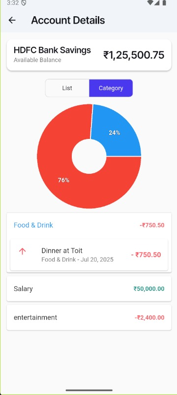
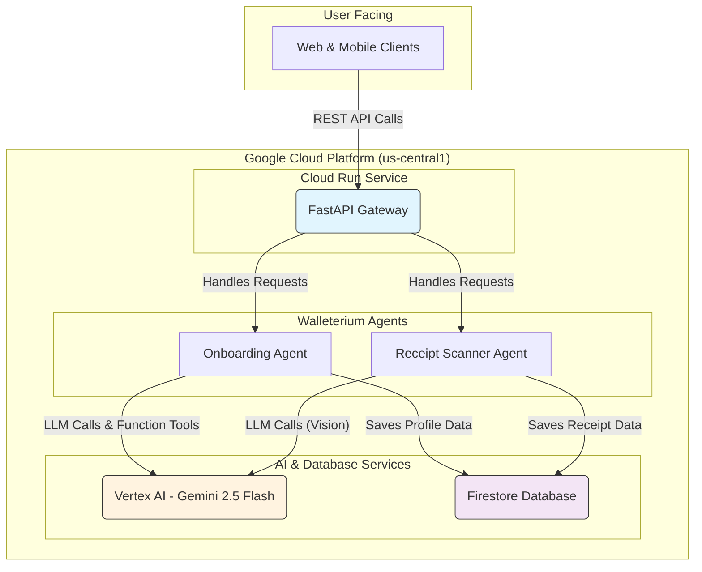
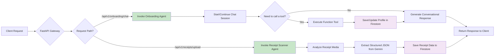
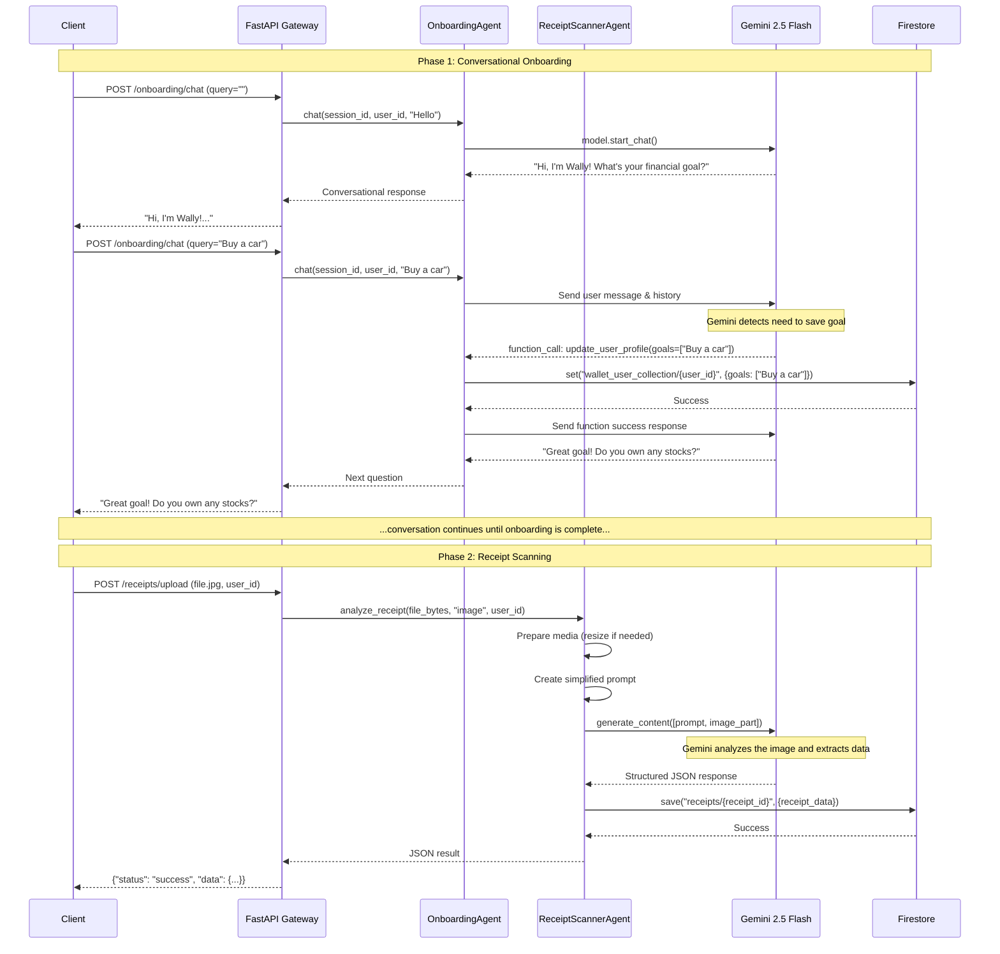

# Walleterium Imperium: AI-Powered Financial Wellness Platform

## 🏆 Hackathon Showcase: Key Results

Here's a quick showcase of what Walleterium Imperium can do. These images highlight the core features and user interactions.

[WATCH DEMO VIDEO](https://drive.google.com/file/d/1OPAnnkUBXNeo_xJHoioyEqRVm66oP8yj/view?usp=drivesdk)





**A Production-Ready, Multi-Agent Financial Assistant powered by FastAPI, Google Gemini, and Google Cloud**

Walleterium Imperium is an intelligent, multi-agent platform designed to provide users with a seamless and conversational financial management experience. It goes beyond simple expense tracking by combining a friendly **Onboarding Agent** to build a personalized user profile with a powerful **Receipt Scanner Agent** to automate data entry.

---

## 🌟 **Key Features & Business Value**

For users, Walleterium Imperium offers a frictionless way to take control of their finances. For businesses, it provides a scalable, cloud-native solution for building next-generation financial applications.

| **Feature** | **User Benefit** | **Business Value** |
|-------------|------------------|--------------------|
| **Conversational Onboarding** | A friendly, engaging way to set up a financial profile without boring forms. | Higher user engagement and retention from day one. |
| **AI-Powered Persona Profiling** | The app understands if the user is a `Budgetor`, `Investor`, `Explorer`, etc., and tailors its advice. | Enables hyper-personalized user experiences and targeted product offerings. |
| **Automated Receipt Scanning** | Instantly digitize receipts from images or videos, eliminating manual entry. | Reduces user friction and provides clean, structured data for analysis. |
| **Cloud-Native & Scalable** | Built on Google Cloud Run to handle millions of users automatically. | Low operational overhead and a cost-effective, pay-per-use model. |
| **Secure & Persistent** | User data is securely stored and managed in Google Firestore. | Ensures data integrity, privacy, and reliability. |

---

## 🏗️ **System Architecture: A Technical Deep Dive**

Walleterium Imperium is built on a modern, decoupled, and scalable architecture. It uses a FastAPI backend that serves as a gateway to two independent AI agents.

### **High-Level System Diagram**

This diagram shows the main components and how they interact within the Google Cloud ecosystem.



### **Component Interaction Flowchart**

This flowchart details the step-by-step logic from user request to final data storage.



### **End-to-End Sequence Diagram: A Unified View**

This diagram illustrates the complete user journey, showing how a user is first onboarded and then scans a receipt.



---

## 🚀 **Getting Started: Local Development**

Follow these steps to run the Walleterium Imperium backend on your local machine.

### **1. Prerequisites**
- Python 3.9+
- [Google Cloud SDK](https://cloud.google.com/sdk/docs/install) installed and authenticated.
- A Google Cloud Project with **Vertex AI** and **Firestore** APIs enabled.

### **2. Installation**
```bash
# Clone the repository
git clone <your-repository-url>
cd WalleteriumImperium

# Create a virtual environment and install dependencies
python -m venv venv
source venv/bin/activate  # On Windows, use `venv\Scripts\activate`
pip install -r requirements.txt
```

### **3. Configuration**
```bash
# Authenticate with Google Cloud for application services
gcloud auth application-default login

# Set your Google Cloud Project ID as an environment variable
# (Replace 'your-gcp-project-id' with your actual project ID)
export GOOGLE_CLOUD_PROJECT_ID="your-gcp-project-id"
```

### **4. Run the Server**
```bash
# Start the FastAPI server with auto-reload for development
uvicorn main:app --host 0.0.0.0 --port 8080 --reload
```
The API is now running at `http://localhost:8080`. You can access the interactive documentation at `http://localhost:8080/docs`.

---

## 🔌 **API Usage Quick-Start**

Interact with the key endpoints to experience the multi-agent system.

### **1. Onboard a New User**

Start a conversation with Wally, the Onboarding Agent. Use the same `session_id` to maintain context.

```bash
# Step 1: Start the conversation
curl -X POST "http://localhost:8080/api/v1/onboarding/chat" \
-H "Content-Type: application/json" \
-d '{
  "user_id": "test_user_001",
  "query": "",
  "language": "en",
  "session_id": "session-abc-123"
}'

# Step 2: Respond to Wally's question
curl -X POST "http://localhost:8080/api/v1/onboarding/chat" \
-H "Content-Type: application/json" \
-d '{
  "user_id": "test_user_001",
  "query": "I want to save up for a trip to Japan!",
  "language": "en",
  "session_id": "session-abc-123"
}'
```

### **2. Scan a Receipt**

Once the user is onboarded, they can scan receipts using the Receipt Scanner Agent.

```bash
# Upload a receipt image for analysis
curl -X POST "http://localhost:8080/api/v1/receipts/upload" \
  -F "file=@/path/to/your/receipt.jpg" \
  -F "user_id=test_user_001"
```

The API will return the extracted JSON data directly.

---

## ☁️ **Deployment to Google Cloud Run**

Deploy the application as a scalable, serverless container.

```bash
# Set your project ID
export PROJECT_ID="your-gcp-project-id"

# Build the container and deploy it to Cloud Run
gcloud run deploy walleterium-imperium \
  --source . \
  --platform managed \
  --region us-central1 \
  --allow-unauthenticated \
  --set-env-vars=GOOGLE_CLOUD_PROJECT_ID=$PROJECT_ID \
  --memory=2Gi \
  --cpu=1
```

Your service will be available at the URL provided by Google Cloud Run.

---

## 🗂️ **Project Structure**

```
/
├── agents/
│   ├── onboarding_agent/   # Manages conversational user profiling
│   └── receipt_scanner/    # Manages receipt analysis from media
├── app/
│   ├── api/                # FastAPI routers for each domain
│   ├── core/               # Configuration and logging setup
│   ├── services/           # Firestore and other external services
│   └── utils/              # Utility functions like monitoring
├── config/                 # Global constants and settings
├── deploy/                 # Deployment scripts and configurations
├── scripts/                # Testing and utility scripts
├── main.py                 # Main FastAPI application entrypoint
├── Dockerfile              # Container definition for Cloud Run
└── README.md               # You are here!
```
