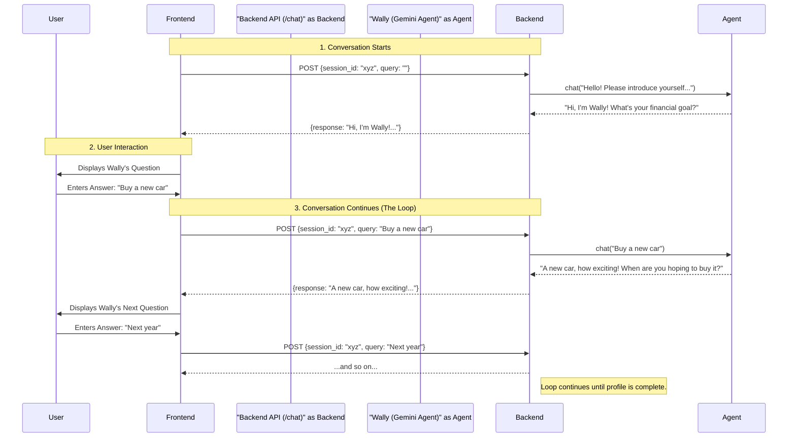
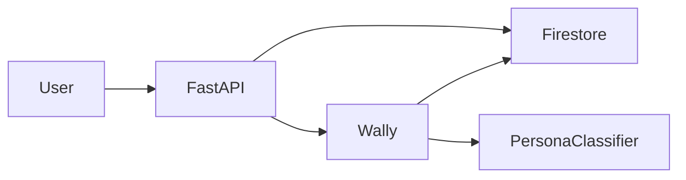

# Onboarding Agent ("Wally")

The Onboarding Agent, "Wally," is a conversational AI designed to create a comprehensive user profile by understanding their financial habits, goals, and risk appetite. It uses a friendly, multi-lingual, and adaptive conversational approach to gather necessary details for personalizing the user's experience in Walleterium Imperium.

## Features

- **Conversational Onboarding**: Engages users in a natural, back-and-forth conversation to gather information, replacing traditional static forms.
- **User Persona Profiling**: Dynamically identifies user personas (`Budgetor`, `Investor`, `Explorer`, `Maximizer`) based on their responses to tailor the app experience.
- **Multi-lingual Support**: Can conduct conversations in multiple languages, specified via an API parameter.
- **Stateful Conversation**: Remembers the entire conversation history for a given session, allowing for context-aware follow-up questions.
- **Structured Data Output**: The gathered information is structured into a clear JSON format in the background, which can be easily used by other services.

## How It Works: The Conversational Loop

The agent works in a simple but powerful request-response loop. The key is that the **frontend always initiates the request**, and the **backend's response always contains the next question**, ensuring the conversation flows naturally. The backend does not trigger requests on its own.

1.  **Conversation Start**: The frontend sends the first `POST` request with an empty `query`.
2.  **Agent Greets**: The backend detects a new conversation and prompts "Wally" to introduce itself and ask its first question.
3.  **User Responds**: The frontend displays Wally's question and sends the user's answer in a new `POST` request, using the same `session_id`.
4.  **Agent Thinks & Asks**: The backend gives the user's answer to Wally. Wally processes the information, updates the user's profile in the background using its tools, and formulates the next logical question.
5.  **Loop Continues**: This loop repeats, with Wally asking new questions based on previous answers, until it has enough information to build a complete user profile and assign a persona.

### Conversation Flow Visualized



## How to Use the API

The entire onboarding conversation is handled by a single API endpoint. You must manage the `session_id` on the client-side to maintain the conversation's state.

- **URL**: `/api/v1/onboarding/chat`
- **Method**: `POST`
- **Headers**: `Content-Type: application/json`

### Step 1: Start the Conversation

To begin the conversation, send a request with an empty `query`. The server will respond with Wally's first question.

**Request (`curl` example):**
```bash
curl -X POST http://localhost:8080/api/v1/onboarding/chat \
-H "Content-Type: application/json" \
-d '{
  "user_id": "kumara123",
  "query": "",
  "language": "en",
  "session_id": "session-unique-123"
}'
```

**Expected Response:**
```json
{
  "response": "Well hello there, future financial superstar! I'm Wally... What's the very first thing you'd do with it?...",
  "session_id": "session-unique-123"
}
```

### Step 2: Continue the Conversation

Take the user's answer and send it as the `query` in the next request. **You must use the same `session_id` for the entire conversation.**

**Request (`curl` example):**
```bash
curl -X POST http://localhost:8080/api/v1/onboarding/chat \
-H "Content-Type: application/json" \
-d '{
  "user_id": "kumara123",
  "query": "I would invest in mutual funds",
  "language": "en",
  "session_id": "session-unique-123"
}'
```

**Expected Response:**
```json
{
  "response": "That's a fantastic choice! Investing in mutual funds tells me you've got a keen eye on making your money work for you... What's a big dream you're saving for this year?",
  "session_id": "session-unique-123"
}
```

Continue this request-response loop until Wally indicates the onboarding is complete.

## 🏗️ High-Level Architecture


## 🤖 LLM Call Pattern

| Turn | Endpoint | Prompt Components | Max Tokens |
|------|----------|-------------------|------------|
| Every user reply | chat.generateContent | system + conversation_history + latest_user | 256 |

## 🔬 Agentic Internals

The agent is built with Google ADK and implements:
- **Memory**: Conversation buffer keyed by `session_id` and persisted in Firestore.
- **Tools**: `classify_persona`, `update_profile`, and `finalize_profile` are auto-invoked to enrich the profile JSON.
- **Validation**: Pydantic schema guards ensure always-valid output before it is saved.

These details satisfy hackathon judging criteria around transparency, reproducibility, and responsible AI.
