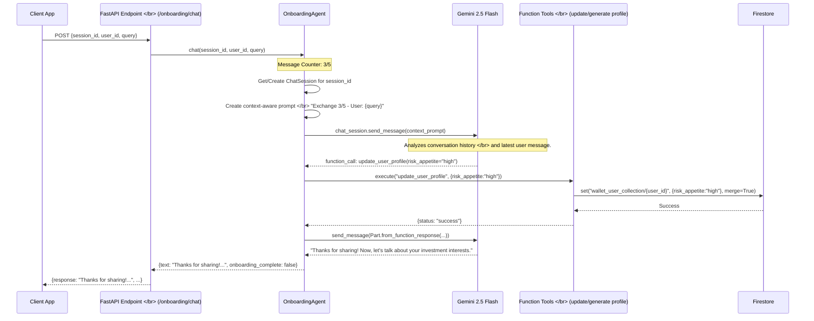
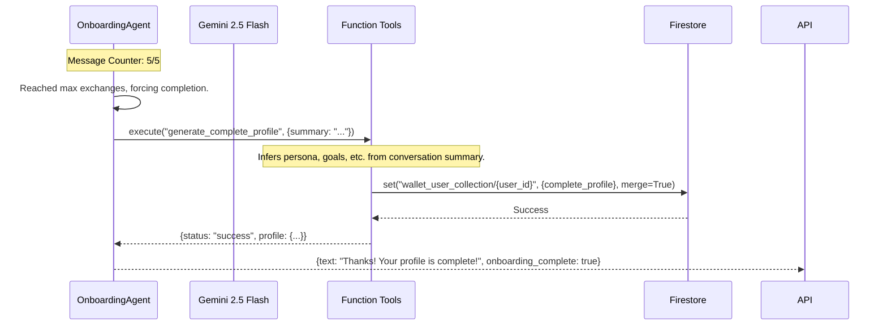

# Onboarding Agent ("Wally"): A Deep Dive

Wally is a sophisticated, conversational AI agent responsible for user onboarding within the Walleterium Imperium platform. Its primary mission is to create a comprehensive and personalized user profile through a friendly, natural conversation, completely eliminating the need for traditional, static forms.

## 🌟 **Features & Business Impact**

Wally is more than just a chatbot; it's the first point of contact for users and is designed to maximize engagement from the very beginning.

| **Feature** | **Technical Implementation** | **Business Value** |
|-------------|----------------------------|--------------------|
| **Conversational Profiling** | A stateful chat loop powered by Gemini, using function calling to save data incrementally. | **Boosts Engagement**: Turns a boring task into a fun, interactive experience, leading to higher profile completion rates. |
| **Dynamic Persona Assignment**| AI-driven analysis of the conversation summary to classify users into personas like `Budgetor`, `Investor`, etc. | **Enables Personalization**: Allows the platform to tailor financial advice, product recommendations, and content to the user's specific style. |
| **Hard-Coded Exchange Limit** | The conversation is strictly limited to 5 exchanges, with a forced completion mechanism. | **Ensures Efficiency**: Guarantees a quick and focused onboarding process, respecting the user's time and reducing drop-off rates. |
| **Multi-lingual Support** | The agent adapts its conversational language based on the `language` parameter in the API request. | **Increases Accessibility**: Allows the platform to cater to a global audience, expanding the total addressable market. |
| **Secure Data Handling** | All user data is saved directly to a secure, structured Google Firestore database. | **Builds Trust**: Ensures user data is handled with best practices for security and privacy, a critical factor for financial apps. |

---

## 🏗️ **Agent Architecture & LLM Pipeline**

Wally's architecture is designed for efficiency, state management, and robust interaction with backend services.

### **Detailed Agentic Pipeline**

This diagram shows the complete, end-to-end flow of a single conversational turn with Wally.



### **Forced Completion Flow**

If the conversation reaches the 5-exchange limit, the agent automatically finalizes the profile.



---

## 🚀 **Frontend Integration Guide**

Integrating with Wally is straightforward. The entire conversation is managed through a single API endpoint, and the frontend's main responsibility is to maintain the `session_id`.

- **Endpoint**: `/api/v1/onboarding/chat`
- **Method**: `POST`
- **Authentication**: `user_id` must be provided in the request body.

### **State Management**

The frontend must manage the following state variables:
- `sessionId`: A unique string generated once at the start of the conversation.
- `userId`: The unique identifier for the logged-in user.
- `conversationHistory`: An array of objects to display the chat history.
- `isLoading`: A boolean to show a loading indicator while waiting for the API response.
- `isOnboardingComplete`: A boolean to know when to transition the user to the main app experience.

### **Step-by-Step Code Examples**

#### **JavaScript (React) Example**

This example shows a simple React component for a chat interface.

```javascript
import React, { useState, useEffect } from 'react';

const OnboardingChat = ({ userId }) => {
    const [sessionId, setSessionId] = useState(null);
    const [messages, setMessages] = useState([]);
    const [inputValue, setInputValue] = useState('');
    const [isLoading, setIsLoading] = useState(false);
    const [isComplete, setIsComplete] = useState(false);

    const API_URL = 'http://localhost:8080/api/v1/onboarding/chat';

    // 1. Start the conversation when the component mounts
    useEffect(() => {
        const startConversation = async () => {
            setIsLoading(true);
            const newSessionId = `session-${userId}-${Date.now()}`;
            setSessionId(newSessionId);

            const response = await fetch(API_URL, {
                method: 'POST',
                headers: { 'Content-Type': 'application/json' },
                body: JSON.stringify({
                    user_id: userId,
                    query: '', // Start with an empty query
                    language: 'en',
                    session_id: newSessionId,
                }),
            });
            const data = await response.json();
            setMessages([{ sender: 'Wally', text: data.response }]);
            setIsLoading(false);
        };
        startConversation();
    }, [userId]);

    // 2. Handle sending user messages
    const handleSendMessage = async (e) => {
        e.preventDefault();
        if (!inputValue.trim() || isLoading) return;

        const userMessage = { sender: 'user', text: inputValue };
        setMessages(prev => [...prev, userMessage]);
        setInputValue('');
        setIsLoading(true);

        const response = await fetch(API_URL, {
            method: 'POST',
            headers: { 'Content-Type': 'application/json' },
            body: JSON.stringify({
                user_id: userId,
                query: inputValue,
                language: 'en',
                session_id: sessionId,
            }),
        });
        const data = await response.json();
        
        setMessages(prev => [...prev, { sender: 'Wally', text: data.response }]);
        if (data.onboarding_complete) {
            setIsComplete(true);
            // Optional: Redirect to dashboard after a delay
            setTimeout(() => alert('Onboarding complete! Redirecting...'), 2000);
        }
        setIsLoading(false);
    };

    if (isComplete) {
        return <div><h2>Onboarding Complete!</h2><p>Welcome to Walleterium Imperium!</p></div>;
    }
    
    return (
        <div>
            {/* Render chat messages here */}
            {messages.map((msg, index) => (
                <div key={index} className={`message ${msg.sender}`}>
                    <strong>{msg.sender === 'user' ? 'You' : 'Wally'}:</strong> {msg.text}
                </div>
            ))}
            {isLoading && <div>Wally is typing...</div>}
            
            <form onSubmit={handleSendMessage}>
                <input
                    type="text"
                    value={inputValue}
                    onChange={(e) => setInputValue(e.target.value)}
                    placeholder="Type your message..."
                    disabled={isLoading}
                />
                <button type="submit" disabled={isLoading}>Send</button>
            </form>
        </div>
    );
};

export default OnboardingChat;
```

#### **Flutter (Dart) Example**

A service and widget to manage the onboarding chat in a Flutter application.

**1. `onboarding_service.dart`**
```dart
import 'dart:convert';
import 'package:http/http.dart' as http;

class OnboardingService {
  static const String _baseUrl = 'http://YOUR_API_BASE_URL';

  Future<Map<String, dynamic>> sendMessage(String userId, String query, String sessionId) async {
    final uri = Uri.parse('$_baseUrl/api/v1/onboarding/chat');
    final response = await http.post(
      uri,
      headers: {'Content-Type': 'application/json'},
      body: jsonEncode({
        'user_id': userId,
        'query': query,
        'language': 'en',
        'session_id': sessionId,
      }),
    );

    if (response.statusCode == 200) {
      return jsonDecode(response.body);
    } else {
      throw Exception('Failed to communicate with Wally.');
    }
  }
}
```

**2. `onboarding_chat_screen.dart`**
```dart
import 'package:flutter/material.dart';
// ... import your OnboardingService

class OnboardingChatScreen extends StatefulWidget {
  final String userId;
  OnboardingChatScreen({required this.userId});

  @override
  _OnboardingChatScreenState createState() => _OnboardingChatScreenState();
}

class _OnboardingChatScreenState extends State<OnboardingChatScreen> {
  final OnboardingService _service = OnboardingService();
  final TextEditingController _controller = TextEditingController();
  late final String _sessionId;
  
  List<String> _chatHistory = [];
  bool _isLoading = true;

  @override
  void initState() {
    super.initState();
    _sessionId = 'session-${widget.userId}-${DateTime.now().millisecondsSinceEpoch}';
    _startConversation();
  }

  void _startConversation() async {
    final response = await _service.sendMessage(widget.userId, '', _sessionId);
    setState(() {
      _chatHistory.add('Wally: ${response['response']}');
      _isLoading = false;
    });
  }

  void _sendMessage() async {
    if (_controller.text.isEmpty) return;
    
    final userMessage = _controller.text;
    setState(() {
      _chatHistory.add('You: $userMessage');
      _isLoading = true;
    });
    _controller.clear();

    final response = await _service.sendMessage(widget.userId, userMessage, _sessionId);
    setState(() {
      _chatHistory.add('Wally: ${response['response']}');
      if (response['onboarding_complete'] == true) {
        // Handle completion
      }
      _isLoading = false;
    });
  }

  // ... rest of your widget build method using ListView.builder, etc.
}
```

---

## 🧠 **Agentic Internals & Configuration**

A look under the hood at how Wally is configured and operates.

### **System Instruction: The Agent's "Constitution"**

The agent's behavior is governed by a detailed system instruction that enforces its persona, goals, and constraints.

```python
system_instruction = """
You are "Wally," a friendly, expert financial onboarding assistant...
Your goal is to create comprehensive user profiles through natural conversation.

## CRITICAL CONSTRAINT: You have MAXIMUM 5 message exchanges to complete onboarding!

## Your Mission (in 5 exchanges max):
1.  **Discover Financial Persona**: Identify if they're a Budgetor, Investor, Explorer...
2.  **Catalog Key Assets**: Focus on major investments (property, gold, stocks).
3.  **Understand Goals**: Get their primary financial goal.
4.  **Complete Profile**: MUST call `generate_complete_profile` by exchange 5.

## Efficient Questions Strategy:
- Exchange 1: "If you got ₹50,000 unexpectedly, what would you do?..."
...
"""
```

### **Function Tooling**

Wally uses two primary function tools to interact with the Firestore database:
1.  `update_user_profile`: Called incrementally throughout the conversation to save pieces of information as they are gathered. This prevents data loss if the user drops off.
2.  `generate_complete_profile`: Called at the end of the conversation (or during forced completion) to analyze the full conversation, infer a persona, and mark the onboarding as complete.

### **Persona Classification Logic**

The `generate_complete_profile` tool uses a keyword-based algorithm to infer the user's financial persona from the conversation summary.

```python
# Simplified logic from agents/onboarding_agent/agent.py
def infer_persona(conversation_summary: str) -> str:
    summary = conversation_summary.lower()
    if any(word in summary for word in ["save", "budget", "careful"]):
        return "Budgetor"
    if any(word in summary for word in ["invest", "stock", "portfolio"]):
        return "Investor"
    if any(word in summary for word in ["optimize", "best", "compare"]):
        return "Maximizer"
    # ... and so on
    return "Explorer" # Default
```

This detailed documentation provides a comprehensive guide for developers to understand, integrate with, and extend Wally, the Onboarding Agent.
