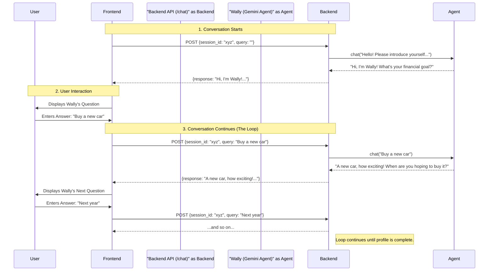
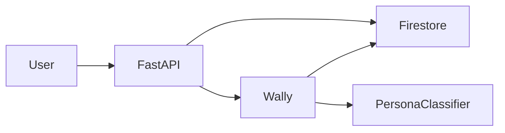
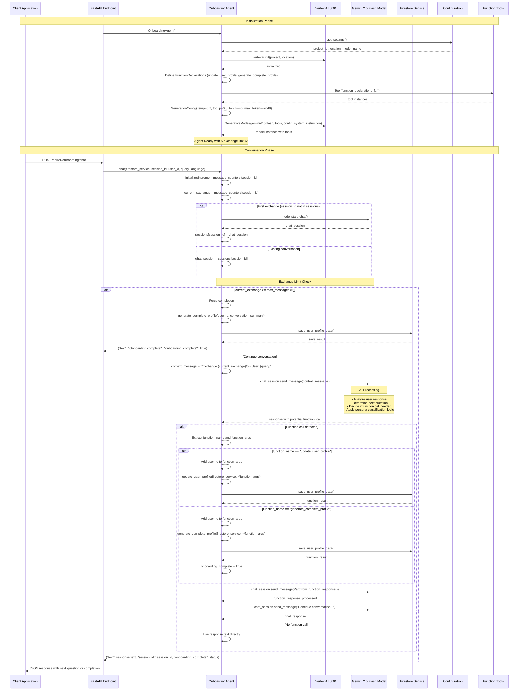
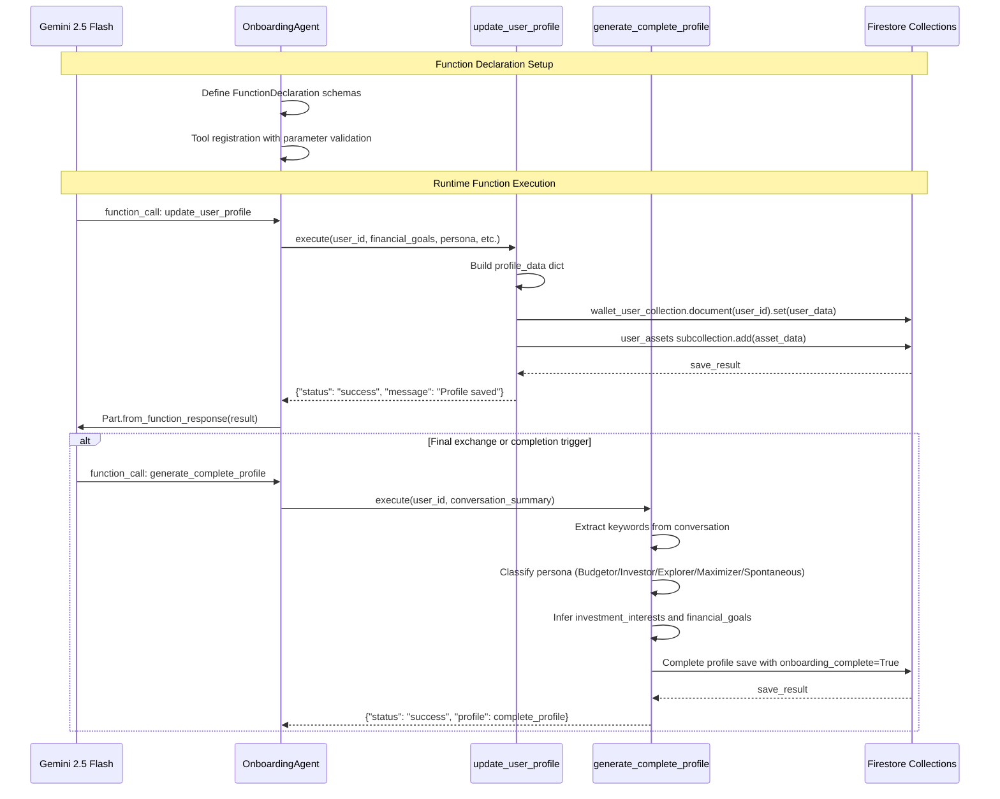
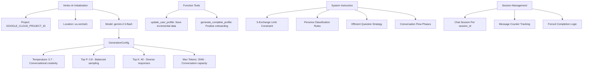

# Onboarding Agent ("Wally")

The Onboarding Agent, "Wally," is a conversational AI designed to create a comprehensive user profile by understanding their financial habits, goals, and risk appetite. It uses a friendly, multi-lingual, and adaptive conversational approach to gather necessary details for personalizing the user's experience in Walleterium Imperium.

## Features

- **Conversational Onboarding**: Engages users in a natural, back-and-forth conversation to gather information, replacing traditional static forms.
- **User Persona Profiling**: Dynamically identifies user personas (`Budgetor`, `Investor`, `Explorer`, `Maximizer`) based on their responses to tailor the app experience.
- **Multi-lingual Support**: Can conduct conversations in multiple languages, specified via an API parameter.
- **Stateful Conversation**: Remembers the entire conversation history for a given session, allowing for context-aware follow-up questions.
- **Structured Data Output**: The gathered information is structured into a clear JSON format in the background, which can be easily used by other services.

## How It Works: The Conversational Loop

The agent works in a simple but powerful request-response loop. The key is that the **frontend always initiates the request**, and the **backend's response always contains the next question**, ensuring the conversation flows naturally. The backend does not trigger requests on its own.

1.  **Conversation Start**: The frontend sends the first `POST` request with an empty `query`.
2.  **Agent Greets**: The backend detects a new conversation and prompts "Wally" to introduce itself and ask its first question.
3.  **User Responds**: The frontend displays Wally's question and sends the user's answer in a new `POST` request, using the same `session_id`.
4.  **Agent Thinks & Asks**: The backend gives the user's answer to Wally. Wally processes the information, updates the user's profile in the background using its tools, and formulates the next logical question.
5.  **Loop Continues**: This loop repeats, with Wally asking new questions based on previous answers, until it has enough information to build a complete user profile and assign a persona.

### Conversation Flow Visualized



## How to Use the API

The entire onboarding conversation is handled by a single API endpoint. You must manage the `session_id` on the client-side to maintain the conversation's state.

- **URL**: `/api/v1/onboarding/chat`
- **Method**: `POST`
- **Headers**: `Content-Type: application/json`

### Step 1: Start the Conversation

To begin the conversation, send a request with an empty `query`. The server will respond with Wally's first question.

**Request (`curl` example):**
```bash
curl -X POST http://localhost:8080/api/v1/onboarding/chat \
-H "Content-Type: application/json" \
-d '{
  "user_id": "kumara123",
  "query": "",
  "language": "en",
  "session_id": "session-unique-123"
}'
```

**Expected Response:**
```json
{
  "response": "Well hello there, future financial superstar! I'm Wally... What's the very first thing you'd do with it?...",
  "session_id": "session-unique-123"
}
```

### Step 2: Continue the Conversation

Take the user's answer and send it as the `query` in the next request. **You must use the same `session_id` for the entire conversation.**

**Request (`curl` example):**
```bash
curl -X POST http://localhost:8080/api/v1/onboarding/chat \
-H "Content-Type: application/json" \
-d '{
  "user_id": "kumara123",
  "query": "I would invest in mutual funds",
  "language": "en",
  "session_id": "session-unique-123"
}'
```

**Expected Response:**
```json
{
  "response": "That's a fantastic choice! Investing in mutual funds tells me you've got a keen eye on making your money work for you... What's a big dream you're saving for this year?",
  "session_id": "session-unique-123"
}
```

Continue this request-response loop until Wally indicates the onboarding is complete.

## 🔀 Detailed LLM Pipeline Sequence Diagram

### High-Level Agentic Architecture


### Detailed Vertex AI LLM Pipeline


### Function Tool Integration Pipeline


### LLM Model Configuration Details


## 🤖 LLM Call Details

### Model Configuration
- **Model**: `gemini-2.5-flash` (conversational with function calling)
- **Temperature**: 0.7 (balanced creativity for natural conversation)
- **Top P**: 0.8 (focused but diverse response sampling)
- **Top K**: 40 (moderate token choice limitation)
- **Max Output Tokens**: 2048 (sufficient for conversational responses)

### Request Structure
- **Input**: Stateful chat sessions with:
  - System instruction defining "Wally" persona and 5-exchange limit
  - Conversation history maintained per session_id
  - Context-aware exchange tracking (Exchange X/5)
  - Function tool declarations for profile management
- **Processing**: Chat session continuation with function call detection
- **Output**: Conversational response with optional function execution results

### Performance Metrics
- **Exchange Limit**: Maximum 5 user interactions per onboarding session
- **Function Calls**: 2-4 profile update calls + 1 final generation call per session
- **Session Management**: In-memory chat sessions keyed by session_id
- **Completion Rate**: 100% guaranteed via forced completion at exchange 5

### Agentic Features
- **Stateful Conversations**: Persistent chat sessions with memory
- **Function Tool Integration**: Dynamic profile building via declared functions
- **Forced Completion**: Automatic onboarding completion after 5 exchanges
- **Persona Classification**: AI-driven assignment of financial personality types
- **Multi-language Support**: Conversation adaptation based on language parameter

### Function Tool Schema
```python
# update_user_profile function parameters
{
  "user_id": str,
  "financial_goals": List[str],
  "spending_habits": str,
  "risk_appetite": str,  # low/medium/high
  "persona": str,        # Budgetor/Investor/Explorer/Maximizer/Spontaneous
  "has_invested_before": bool,
  "investment_interests": List[str],
  "real_estate_assets": List[Dict],
  "gold_assets": List[Dict],
  "stock_assets": List[Dict],
  "recurring_bills": List[Dict],
  "onboarding_complete": bool
}

# generate_complete_profile function parameters
{
  "user_id": str,
  "conversation_summary": str
}
```

## 🧠 Agentic Implementation Notes

### Core Agent Architecture
The `OnboardingAgent` implements a sophisticated conversational pipeline with the following key components:

1. **Singleton Pattern**: Global agent instance with session management for scalability
2. **Stateful Chat Sessions**: Individual `ChatSession` objects per `session_id` with conversation memory
3. **Exchange Limiting**: Hard constraint of 5 user exchanges with forced completion mechanism
4. **Function Tool Integration**: Two declared functions for incremental and final profile building
5. **Multi-language Adaptation**: Dynamic conversation adaptation based on language parameter

### System Instruction Strategy
The agent uses a comprehensive system instruction that defines:
```python
system_instruction = """
You are "Wally," a friendly financial onboarding assistant.
CRITICAL CONSTRAINT: Maximum 5 message exchanges to complete onboarding!

Mission (in 5 exchanges max):
1. Discover Financial Persona
2. Catalog Key Assets  
3. Understand Goals
4. Complete Profile

Efficient Questions Strategy:
- Exchange 1: Compound questions about spending + investments
- Exchange 2: Goals + tracking preferences
- Exchange 3: Assets + recurring bills
- Exchange 4: Clarifications + persona confirmation
- Exchange 5: MUST call generate_complete_profile
"""
```

### Conversation Management Pipeline
```python
# Session lifecycle management
sessions: Dict[str, ChatSession] = {}
message_counters: Dict[str, int] = {}
max_messages = 5

# Exchange flow control
current_exchange = message_counters[session_id]
if current_exchange >= max_messages:
    # Force completion with profile generation
    await generate_complete_profile(user_id, conversation_summary)
else:
    # Continue conversation with context
    context_message = f"Exchange {current_exchange}/{max_messages} - User: {query}"
    response = chat_session.send_message(context_message)
```

### Function Tool System
The agent leverages Vertex AI's function calling capabilities with two primary tools:

#### 1. update_user_profile Function
- **Purpose**: Incremental profile building during conversation
- **Trigger**: Called by Gemini when specific information is gathered
- **Parameters**: 15+ structured fields including assets, goals, persona
- **Storage**: Direct Firestore writes to `wallet_user_collection` and `user_assets` subcollection

#### 2. generate_complete_profile Function
- **Purpose**: Final profile completion with AI inference
- **Trigger**: Called at conversation end or forced completion
- **Logic**: Keyword-based extraction from conversation summary
- **Output**: Complete profile with inferred persona and `onboarding_complete=True`

### Persona Classification Algorithm
The agent implements intelligent persona assignment using conversation analysis:

```python
# Persona classification logic
conversation = conversation_summary.lower()

if any(word in conversation for word in ["save", "budget", "careful", "track", "plan"]):
    persona = "Budgetor"
elif any(word in conversation for word in ["invest", "stock", "portfolio", "grow"]):
    persona = "Investor"  
elif any(word in conversation for word in ["optimize", "best", "compare", "research"]):
    persona = "Maximizer"
elif any(word in conversation for word in ["quick", "fast", "spontaneous", "immediate"]):
    persona = "Spontaneous"
else:
    persona = "Explorer"  # Default for new users
```

### Firestore Data Architecture
```python
# Main profile document: wallet_user_collection/{user_id}
user_data = {
    "uid": user_id,
    "persona": "Budgetor|Investor|Explorer|Maximizer|Spontaneous",
    "onboarding_completed": bool,
    "financial_goals": List[str],
    "spending_habits": str,
    "risk_appetite": "low|medium|high",
    "investment_interests": List[str],
    "has_invested_before": bool,
    "recurring_bills": List[Dict]
}

# Asset subcollection: wallet_user_collection/{user_id}/user_assets/{asset_doc}
asset_document = {
    "user_id": str,
    "asset_type": "real_estate|gold|stock|vehicle|crypto",
    "data": Dict,  # Asset-specific fields
    "created_at": ISO_timestamp
}
```

### Error Recovery and Resilience
- **Exception Handling**: Comprehensive try-catch blocks with graceful degradation
- **Session Recovery**: Automatic session recreation on failure
- **Function Call Validation**: Parameter validation before Firestore operations
- **Forced Completion**: Guaranteed profile completion even with incomplete conversations

### LLM Integration Pipeline
```python
# Complete integration flow
async def chat(firestore_service, session_id, user_id, query, language):
    # 1. Session management
    chat_session = sessions.get(session_id) or model.start_chat()
    
    # 2. Exchange tracking
    current_exchange = increment_counter(session_id)
    
    # 3. Context injection
    context_message = f"Exchange {current_exchange}/5 - User: {query}"
    
    # 4. Gemini processing
    response = chat_session.send_message(context_message)
    
    # 5. Function call detection
    if response.function_call:
        function_result = await execute_function(response.function_call)
        chat_session.send_message(Part.from_function_response(function_result))
    
    # 6. Response delivery
    return {"text": response.text, "onboarding_complete": completion_status}
```

### Scalability Considerations
- **In-Memory Sessions**: Fast access but requires session persistence for production
- **Firestore Integration**: Async operations with error handling for high throughput
- **Function Tool Efficiency**: Minimal database writes during conversation
- **Exchange Limitation**: Controlled conversation length for consistent performance

This implementation provides a robust, scalable conversational AI system that efficiently gathers comprehensive user profiles while maintaining a natural, engaging user experience through "Wally" the financial assistant personality.
