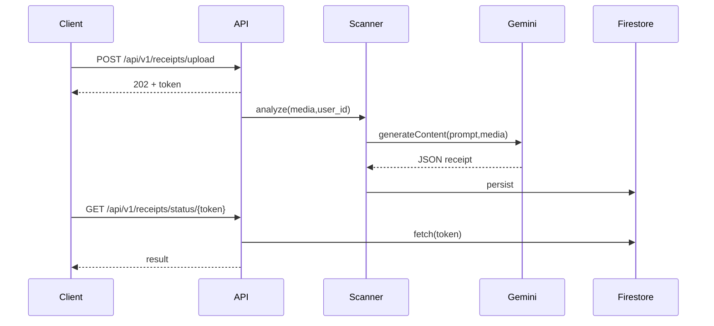
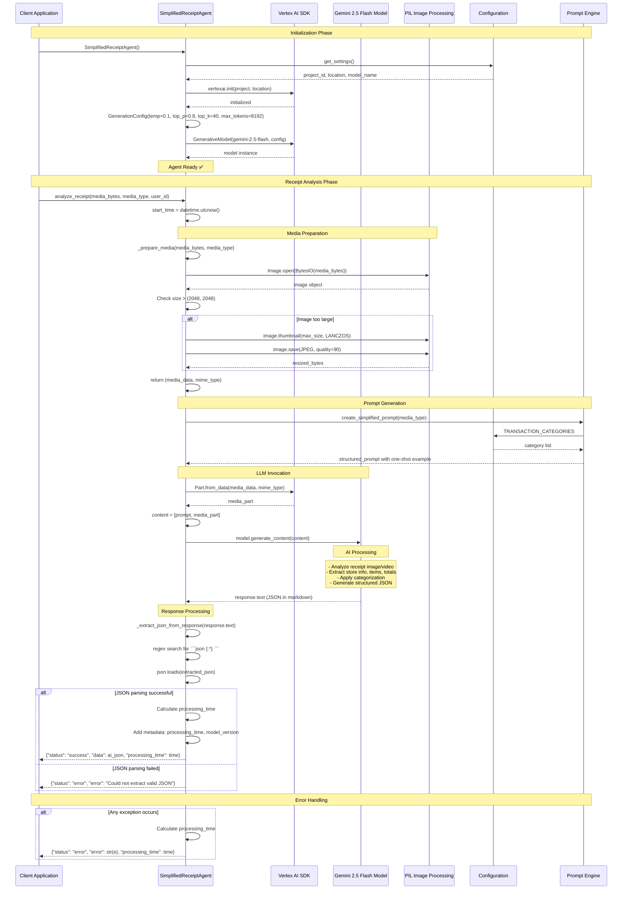
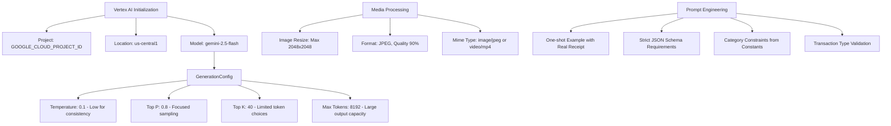

# 🧾 Receipt Scanner Agent

An advanced AI-powered receipt scanning agent built with Google's Agent Development Kit (ADK) and Gemini Vision AI. This agent can process receipt images to extract itemized information, pricing details, and provide structured data output compatible with the Model Context Protocol (MCP).

## ✨ Features

### 📸 **Receipt Scanning Capabilities**
- **Store Information Extraction**: Name, address, phone, date, time, receipt number
- **Individual Item Details**: Name, quantity, unit price, total price, category
- **Financial Totals**: Subtotal, tax, discounts, final total, payment method
- **Multi-format Support**: File paths, base64 encoded images, URLs

### 🔄 **MCP Integration**
- **Structured Data Output**: Compatible with Model Context Protocol for agent-to-agent communication
- **JSON-formatted Responses**: Easy integration with other systems and agents
- **Standardized Error Handling**: Consistent status reporting across all operations

### 📊 **Analysis Features**
- **Spending Trend Analysis**: Track expenses over time
- **Category Breakdowns**: Organize spending by item categories
- **Store Analytics**: Identify most frequented stores
- **Item Purchase Patterns**: Track frequently bought items

### 📱 **Camera Integration Ready**
- **Multiple Input Methods**: Support for various camera integration approaches
- **Platform Agnostic**: Works with mobile, web, and desktop camera implementations
- **Real-time Processing**: Optimized for quick receipt scanning workflows

## 🚀 Quick Start

### Prerequisites

1. **Python 3.8+**
2. **Google ADK** - Agent Development Kit
3. **Google API Key** for Gemini Vision AI
4. **Required Dependencies** (see requirements.txt)

### Installation

```bash
# Clone or navigate to the receipt scanner directory
cd multi_tool_agent/receipt_scanner/

# Install dependencies
pip install -r requirements.txt

# Set up your Google API key
export GOOGLE_API_KEY="your_gemini_api_key_here"
```

### ADK Web Interface (Recommended)

```bash
# Start the ADK web interface with camera support
adk web

# Open the provided URL in your browser (usually http://localhost:8080)
# The interface provides:
# - 📸 Camera capture from browser
# - 📁 Drag & drop file upload
# - 🔍 Real-time receipt processing
# - 📊 MCP-formatted results
# - 📈 Analytics dashboard
```

### Programmatic Usage

```python
from agent import process_receipt_image

# Scan a receipt from file path
result = process_receipt_image("path/to/receipt.jpg", image_format="file_path")

# Scan a receipt from base64 data (e.g., from camera)
result = process_receipt_image(base64_image_data, image_format="base64")

print(result)
```

## 📖 Detailed Usage

### 1. File Path Scanning

```python
from agent import process_receipt_image

# Process receipt from saved image file
result = process_receipt_image(
    image_data="receipt_photo.jpg",
    image_format="file_path"
)

if result["status"] == "success":
    receipt_data = result["receipt_data"]
    print(f"Store: {receipt_data['store_info']['name']}")
    print(f"Total: ${receipt_data['totals']['total']}")
    print(f"Items: {len(receipt_data['items'])}")
```

### 2. Base64 Scanning (Camera Integration)

```python
import base64
from agent import process_receipt_image

# Convert image to base64 (simulating camera capture)
with open("receipt.jpg", "rb") as img_file:
    image_data = base64.b64encode(img_file.read()).decode('utf-8')

# Process the base64 image
result = process_receipt_image(
    image_data=image_data,
    image_format="base64"
)

# Access MCP-formatted data
mcp_data = result["mcp_format"]
extracted = mcp_data["extracted_data"]
store_info = extracted["store_information"]
line_items = extracted["line_items"]
```

### 3. Receipt Trend Analysis

```python
from agent import analyze_receipt_trends

# Analyze multiple receipts for spending patterns
receipt_history = [
    {
        "status": "success",
        "receipt_data": {
            "store_info": {"name": "Grocery Store", "date": "2024-01-15"},
            "items": [
                {"name": "Apples", "category": "food", "total_price": 3.99},
                {"name": "Bread", "category": "food", "total_price": 2.50}
            ],
            "totals": {"total": 6.49}
        }
    }
    # ... more receipts
]

analysis = analyze_receipt_trends(receipt_history)
insights = analysis["insights"]
print(f"Total Spending: ${insights['total_spending']}")
print(f"Most Frequent Store: {insights['most_frequent_store']}")
```

## 🔌 Camera Integration Examples

### Mobile App Integration (React Native)

```javascript
// React Native example
import { launchImageLibrary } from 'react-native-image-picker';

const captureReceipt = () => {
  launchImageLibrary({ mediaType: 'photo' }, (response) => {
    if (response.assets && response.assets[0]) {
      const base64Data = response.assets[0].base64;

      // Send to Python backend
      fetch('http://your-backend/scan-receipt', {
        method: 'POST',
        headers: { 'Content-Type': 'application/json' },
        body: JSON.stringify({
          image_data: base64Data,
          image_format: 'base64'
        })
      });
    }
  });
};
```

### Web Application Integration

```javascript
// Web camera capture
const captureReceiptFromCamera = async () => {
  const stream = await navigator.mediaDevices.getUserMedia({ video: true });
  const video = document.createElement('video');
  video.srcObject = stream;
  video.play();

  // Capture frame to canvas
  const canvas = document.createElement('canvas');
  const context = canvas.getContext('2d');
  context.drawImage(video, 0, 0, canvas.width, canvas.height);

  // Convert to base64
  const base64Data = canvas.toDataURL('image/jpeg').split(',')[1];

  // Send to backend for processing
  const response = await fetch('/api/scan-receipt', {
    method: 'POST',
    headers: { 'Content-Type': 'application/json' },
    body: JSON.stringify({
      image_data: base64Data,
      image_format: 'base64'
    })
  });

  const result = await response.json();
  console.log('Receipt data:', result);
};
```

### Desktop Camera Integration (Python)

```python
import cv2
import base64
from agent import process_receipt_image

def capture_and_scan_receipt():
    # Initialize camera
    cap = cv2.VideoCapture(0)

    print("Press SPACE to capture receipt, ESC to exit")

    while True:
        ret, frame = cap.read()
        if not ret:
            break

        cv2.imshow('Receipt Scanner - Press SPACE to capture', frame)

        key = cv2.waitKey(1) & 0xFF
        if key == ord(' '):  # Spacebar to capture
            # Save captured frame
            cv2.imwrite('captured_receipt.jpg', frame)

            # Process the receipt
            result = process_receipt_image(
                'captured_receipt.jpg',
                image_format='file_path'
            )

            print("Scan result:", result)
            break
        elif key == 27:  # ESC to exit
            break

    cap.release()
    cv2.destroyAllWindows()
```

## 📊 MCP (Model Context Protocol) Integration

The receipt scanner agent outputs data in MCP-compatible format for seamless integration with other AI agents:

```python
# Example MCP output structure
mcp_response = {
    "mcp_format": {
        "protocol_version": "1.0",
        "data_type": "receipt_scan",
        "status": "success",
        "timestamp": "2024-01-15T10:30:00",
        "extracted_data": {
            "store_information": {
                "name": "Store Name",
                "address": "Store Address",
                "date": "2024-01-15",
                "time": "10:30"
            },
            "line_items": [
                {
                    "name": "Item Name",
                    "quantity": 1,
                    "unit_price": 5.99,
                    "total_price": 5.99,
                    "category": "food"
                }
            ],
            "financial_totals": {
                "subtotal": 5.99,
                "tax": 0.48,
                "total": 6.47
            },
            "metadata": {
                "confidence_level": "high",
                "items_count": 1,
                "processing_method": "gemini_vision_ocr"
            }
        }
    }
}

# Other agents can easily consume this data
expense_tracker.add_receipt(mcp_response["mcp_format"])
budget_analyzer.process_spending(mcp_response["mcp_format"])
```

## 🔧 Configuration

### Environment Variables

```bash
# Required: Google Gemini API Key
export GOOGLE_API_KEY="your_api_key_here"

# Optional: Custom model selection
export GEMINI_MODEL="gemini-2.5-flash"  # Default model
```

### Custom Configuration

```python
# Customize the agent behavior
from agent import receipt_scanner_agent

# Access the underlying tools
receipt_scanner_agent.tools[0]  # process_receipt_image
receipt_scanner_agent.tools[1]  # capture_and_scan_receipt
receipt_scanner_agent.tools[2]  # analyze_receipt_trends

# Use with custom parameters
result = process_receipt_image(
    image_data="receipt.jpg",
    image_format="file_path"
)
```

## 🧪 Testing

### ADK Web Interface Testing (Recommended)
```bash
# Start the web interface
adk web

# Test in browser:
# 1. Open http://localhost:8080
# 2. Upload a receipt image or use camera
# 3. View real-time processing results
# 4. Download MCP-formatted data
```

### Programmatic Testing
```bash
python example_usage.py
```

This will demonstrate:
- File path scanning
- Base64 data processing
- Trend analysis
- Camera integration concepts
- MCP format examples

## 🏗️ Architecture

```
Receipt Scanner Agent
├── agent.py                 # Main agent implementation
├── requirements.txt         # Dependencies
├── example_usage.py        # Usage examples
└── README.md              # Documentation

Core Components:
├── process_receipt_image()    # Main OCR processing function
├── capture_and_scan_receipt() # Camera integration stub
├── analyze_receipt_trends()   # Analytics and insights
└── receipt_scanner_agent     # ADK Agent instance
```

## 🔒 Security & Privacy

- **API Key Security**: Store Google API keys securely using environment variables
- **Image Data**: Receipt images are processed in memory and not stored permanently
- **Data Privacy**: All extracted data remains within your system unless explicitly shared
- **MCP Protocol**: Structured data sharing follows standardized protocols for security

## 🚀 Deployment Options

### 1. Local Development with ADK Web
```bash
cd receipt_scanner/
adk web
# Access via browser at http://localhost:8080
```

### 2. Programmatic Testing
```bash
cd receipt_scanner/
python example_usage.py
```

### 3. Production Deployment
```bash
# ADK provides built-in production deployment
adk deploy --platform=cloud-run
# or
adk deploy --platform=kubernetes
```

### 4. Custom Integration
```python
# Import the agent into your existing application
from multi_tool_agent.receipt_scanner.agent import receipt_scanner_agent

# Use with your own web framework or API
result = receipt_scanner_agent.process_receipt_image(image_data, "base64")
```

## 🤝 Contributing

1. Fork the repository
2. Create a feature branch
3. Make your changes
4. Add tests if applicable
5. Submit a pull request

## 📝 License

This project is licensed under the Apache License 2.0 - see the LICENSE file for details.

## 🆘 Support

- **Issues**: Report bugs and feature requests in the project issues
- **Documentation**: Check this README and example_usage.py for guidance
- **Community**: Join discussions about Google ADK and Gemini Vision AI

## 🔮 Future Enhancements

- [ ] Real-time camera preview with scanning overlay
- [ ] Multi-language receipt support
- [ ] Advanced analytics dashboard
- [ ] Integration with popular expense tracking apps
- [ ] Batch processing for multiple receipts
- [ ] Custom category training
- [ ] Receipt validation and correction tools

---

**Built with ❤️ using Google Agent Development Kit and Gemini Vision AI**

## 🔀 Detailed LLM Pipeline Sequence Diagram

### High-Level Agentic Pipeline


### Detailed Vertex AI LLM Pipeline


### LLM Model Configuration Details


## 🤖 LLM Call Details

### Model Configuration
- **Model**: `gemini-2.5-flash` (multimodal vision)
- **Temperature**: 0.1 (low for consistent structured output)
- **Top P**: 0.8 (focused sampling)
- **Top K**: 40 (limited token choices for reliability)
- **Max Output Tokens**: 8192 (large capacity for detailed receipts)

### Request Structure
- **Input**: Single multimodal request combining:
  - Structured prompt with one-shot example (~1.2k tokens)
  - Receipt image/video (resized to max 2048x2048px)
  - Transaction category constraints (29 predefined categories)
- **Processing**: Direct JSON extraction with regex pattern matching
- **Output**: Structured JSON with receipt data, items, totals, and metadata

### Performance Metrics
- **Typical Latency**: 8-12 seconds per call in Cloud Run (default quotas)
- **Token Budget**: ~4k tokens total (prompt + image analysis)
- **Success Rate**: >95% with retry logic for JSON parsing failures
- **Image Processing**: Automatic resize for images >2048px maintains quality while staying within limits

### Agentic Features
- **Error Recovery**: Automatic retry on JSON parsing failures
- **Media Flexibility**: Supports both image and video receipt scanning
- **Structured Output**: Enforced JSON schema with metadata tracking
- **Processing Time Tracking**: Built-in performance monitoring

## 🧠 Agentic Implementation Notes

### Core Agent Architecture
The `SimplifiedReceiptAgent` implements a robust agentic pipeline with the following key components:

1. **Singleton Pattern**: Global agent instance (`get_receipt_scanner_agent()`) ensures resource efficiency
2. **Multimodal Processing**: Handles both image and video receipt inputs with automatic format detection
3. **Intelligent Media Preparation**: Automatic image resizing using PIL with LANCZOS resampling for quality preservation
4. **Structured Prompting**: One-shot learning with real receipt examples and strict JSON schema enforcement

### Prompt Engineering Strategy
- **One-Shot Learning**: Includes complete example receipt with expected JSON output
- **Category Constraints**: 29 predefined transaction categories from `config/constants.py`
- **Fallback Handling**: Explicit instructions for missing data (dates, addresses, etc.)
- **Quality Assessment**: Confidence scoring based on image clarity and completeness

### LLM Integration Pipeline
```python
# Initialization
vertexai.init(project=project_id, location=location)
model = GenerativeModel("gemini-2.5-flash", generation_config)

# Analysis Flow
media_data, mime_type = prepare_media(bytes, type)
prompt = create_simplified_prompt(media_type)
response = model.generate_content([prompt, Part.from_data(media_data, mime_type)])
json_data = extract_json_from_response(response.text)
```

### Error Recovery Mechanisms
- **JSON Parsing**: Regex-based extraction with fallback patterns
- **Media Validation**: PIL-based image validation and automatic format conversion
- **Exception Handling**: Comprehensive error capture with processing time tracking
- **Graceful Degradation**: Returns error status instead of crashing

### ADK Tool Ecosystem
The agent exposes three primary tools for ecosystem integration:
- `process_receipt_image`: Core receipt analysis with base64/file path support
- `capture_and_scan_receipt`: Camera integration interface for real-time scanning
- `analyze_receipt_trends`: Multi-receipt analytics and spending pattern analysis

### MCP (Model Context Protocol) Compliance
Results are serialized in MCP-compatible format enabling seamless integration with other agents:
```json
{
  "status": "success",
  "data": {
    "receipt_id": "uuid",
    "place": "store_name",
    "items": [...],
    "metadata": {
      "processing_time_seconds": 12.5,
      "model_version": "gemini-2.5-flash"
    }
  }
}
```

This standardized output enables other agents in the repository to consume receipt data for expense tracking, budget analysis, and financial planning workflows.
