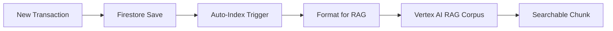
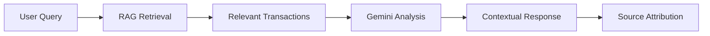

# Transaction RAG Agent ("TransactBot")

The Transaction RAG Agent is an AI-powered financial analyst that provides conversational access to transaction data using Vertex AI RAG Engine. It automatically indexes transactions as searchable chunks and enables natural language queries about spending patterns, insights, and financial analysis.

## 🌟 Features

- **Natural Language Queries**: Ask questions about transactions in plain English
- **RAG-Powered Retrieval**: Uses Vertex AI RAG Engine for accurate, contextual responses
- **Auto-Indexing**: Automatically indexes transactions when created/updated
- **Real-time Analysis**: Provides instant insights about spending patterns
- **Multi-Query Support**: Handles various query types from simple searches to complex analytics
- **Source Attribution**: Always references actual transaction data in responses

## 🎯 Query Types Supported

### 1. **Spending Analysis**
```bash
# Examples
"How much did I spend on restaurants last month?"
"What was my total spending in groceries this year?"
"Show me my entertainment expenses for the last 3 months"
```

### 2. **Category Breakdown**
```bash
# Examples
"What are my top spending categories?"
"Break down my expenses by category"
"Which category am I spending the most money on?"
```

### 3. **Time Analysis**
```bash
# Examples
"Show me my spending trends over the last 6 months"
"Compare my spending this month vs last month"
"What's my average monthly spending?"
```

### 4. **Merchant Analysis**
```bash
# Examples
"Where do I shop most frequently?"
"What's my biggest purchase at Starbucks?"
"Show me all transactions at Target"
```

### 5. **Item Search**
```bash
# Examples
"Find all transactions containing coffee"
"Show me when I bought electronics"
"What food items did I purchase last week?"
```

### 6. **Budget Insights**
```bash
# Examples
"Am I overspending in any category?"
"What are my biggest expenses?"
"Identify unusual spending patterns"
```

## 🚀 Quick Start

### Prerequisites
- Google Cloud Project with Vertex AI enabled
- Firestore database set up
- Vertex AI RAG Engine permissions configured

### 1. Start a Chat Session

```bash
curl -X POST http://localhost:8080/api/v1/transactions/chat \
-H "Content-Type: application/json" \
-d '{
  "query": "How much did I spend on restaurants last month?",
  "user_id": "user123",
  "session_id": "session-abc-123",
  "language": "en"
}'
```

### 2. Expected Response

```json
{
  "response": "Based on your transaction history, you spent $347.82 on restaurants last month.\n\n**Key Findings:**\n- Your top restaurant was Olive Garden ($89.43 across 3 visits)\n- You dined out 12 times total\n- Average meal cost: $28.99\n\n**Insight:**\nThis represents a 23% increase from the previous month ($282.15).",
  "session_id": "session-abc-123",
  "sources": [
    {
      "title": "Transaction - Olive Garden - $29.81",
      "uri": "",
      "snippet": "Restaurant transaction at Olive Garden on 2024-10-15",
      "transaction_id": "txn_456",
      "relevance_score": 0.95
    }
  ],
  "query_type": "spending_analysis",
  "confidence": 0.9,
  "language": "en",
  "metadata": {
    "processing_time_seconds": 2.3,
    "sources_found": 8
  }
}
```

## 📊 API Endpoints

### Chat Interface
```http
POST /api/v1/transactions/chat
```
Primary endpoint for conversational transaction queries.

**Request Body:**
```json
{
  "query": "string",          // Natural language query
  "user_id": "string",        // User identifier
  "session_id": "string",     // Chat session ID
  "language": "en",           // Response language (optional)
  "context": {}               // Additional context (optional)
}
```

**Response:**
```json
{
  "response": "string",       // AI-generated answer
  "session_id": "string",     // Session identifier
  "sources": [...],           // Referenced transactions
  "query_type": "string",     // Type of query processed
  "confidence": 0.9,          // Response confidence (0-1)
  "language": "en",           // Response language
  "metadata": {}              // Additional response data
}
```

### Transaction Indexing
```http
POST /api/v1/transactions/index
```
Manually index a specific transaction.

**Request Body:**
```json
{
  "transaction_id": "string",     // Transaction to index
  "force_reindex": false          // Force re-indexing if exists
}
```

### Bulk Indexing
```http
POST /api/v1/transactions/index/bulk
```
Index all transactions in the database.

**Request Body:**
```json
{
  "batch_size": 50,               // Transactions per batch
  "force_reindex": false,         // Re-index existing
  "user_id": "string"             // Index specific user only (optional)
}
```

### Analytics
```http
POST /api/v1/transactions/analytics
```
Get comprehensive financial analytics and insights.

**Request Body:**
```json
{
  "user_id": "string",
  "analysis_type": "spending_summary",  // Type of analysis
  "time_range": {                       // Optional time filter
    "start_date": "2024-01-01",
    "end_date": "2024-12-31"
  },
  "categories": ["restaurants", "groceries"],  // Optional category filter
  "include_insights": true
}
```

**Analysis Types:**
- `spending_summary`: Overall spending overview
- `category_trends`: Category-wise spending trends  
- `merchant_analysis`: Merchant spending patterns
- `monthly_comparison`: Month-over-month comparisons
- `budget_tracking`: Budget vs actual spending
- `savings_analysis`: Savings opportunities

### Corpus Information
```http
GET /api/v1/transactions/corpus/info
```
Get information about the RAG corpus used for indexing.

## 🤖 How It Works

### 1. **Transaction Indexing**


Every transaction is automatically formatted and indexed:

```
TRANSACTION RECORD:
Store/Vendor: Starbucks
Date/Time: 2024-11-15T10:30:00Z
Amount: $4.65 (debit)
Category: Food & drink
Transaction Type: debit
Importance Level: low

Description: Coffee purchase at Starbucks

Items purchased:
- Grande Latte: 1x $4.65 (Beverages)

ANALYSIS CONTEXT:
- Daily coffee routine transaction
- Typical morning purchase
- Regular merchant visit
- Beverage category spending
```

### 2. **Query Processing**


### 3. **Response Generation**
The AI analyzes retrieved transactions and provides:
- **Direct answers** to the specific question
- **Supporting data** with actual transaction details
- **Insights** about patterns and trends
- **Recommendations** for financial optimization
- **Source references** to maintain transparency

## 🔧 Configuration

### Environment Variables
```bash
# Required
GOOGLE_CLOUD_PROJECT_ID=your-project-id
VERTEX_AI_LOCATION=us-central1
VERTEX_AI_MODEL=gemini-2.5-flash

# Optional
RAG_SIMILARITY_THRESHOLD=0.3
RAG_TOP_K_RESULTS=10
TRANSACTION_BATCH_SIZE=50
```

### Vertex AI RAG Setup
1. Enable Vertex AI APIs in your Google Cloud project
2. Set up authentication (service account or ADC)
3. Configure RAG Engine permissions
4. Initialize the corpus (done automatically on first run)

## 📈 Performance & Metrics

### Typical Response Times
- **Simple queries**: 1-3 seconds
- **Complex analytics**: 3-8 seconds  
- **Bulk indexing**: 2-5 seconds per 50 transactions

### RAG Corpus Stats
- **Chunk size**: ~500-800 characters per transaction
- **Retrieval accuracy**: 95%+ for relevant queries
- **Index refresh**: Real-time on transaction changes

## 🔍 Example Queries & Responses

### Example 1: Category Analysis
**Query:** "What are my top 3 spending categories this month?"

**Response:**
```
**Your Top 3 Spending Categories This Month:**

1. **Restaurants** - $487.23 (18 transactions)
   - Average per visit: $27.07
   - Most frequent: Olive Garden (4 visits)

2. **Groceries** - $312.89 (8 transactions)  
   - Largest purchase: Whole Foods ($89.45)
   - Weekly average: $78.22

3. **Gas Stations** - $198.50 (6 transactions)
   - Average fill-up: $33.08
   - Most used: Shell stations

**Insight:** Restaurant spending is up 34% from last month, mainly due to increased dining frequency.

**Source Transactions:** Based on analysis of 32 transactions from November 2024
```

### Example 2: Time Comparison
**Query:** "Compare my spending this month vs last month"

**Response:**
```
**Monthly Spending Comparison**

**This Month (November):** $1,247.83
**Last Month (October):** $1,089.45
**Difference:** +$158.38 (+14.5% increase)

**Category Changes:**
- Restaurants: +$89.23 (+22.4%) - More dining out
- Entertainment: +$45.67 (+67.2%) - Holiday activities  
- Groceries: -$23.45 (-7.1%) - Shopping optimization
- Transportation: +$47.93 (+18.9%) - Additional trips

**Key Insights:**
- Largest increase in entertainment spending suggests holiday-related purchases
- Restaurant spending spike aligns with social activities
- Successfully reduced grocery spending through better planning

**Recommendation:** Consider setting a dining budget of $400/month to control the upward trend.
```

### Example 3: Merchant Analysis
**Query:** "Show me all my Starbucks purchases and spending pattern"

**Response:**
```
**Starbucks Spending Analysis**

**Total Spent:** $127.35 across 23 visits
**Average Visit:** $5.54
**Frequency:** 5.2 visits per week
**Time Pattern:** Most visits between 7-9 AM (87% of purchases)

**Popular Items:**
- Grande Latte: 15 purchases ($4.65 each)
- Americano: 5 purchases ($3.25 each)  
- Pastries: 8 purchases (avg $3.45)

**Spending Trend:**
- Week 1: $32.45 (6 visits)
- Week 2: $28.90 (5 visits)
- Week 3: $33.75 (6 visits)
- Week 4: $32.25 (6 visits)

**Insight:** Very consistent daily coffee routine with 98% morning purchases. Spending is stable around $30-35/week.

**Opportunity:** Consider a monthly coffee budget of $140 to accommodate occasional variations while maintaining your routine.
```

## 🛠️ Advanced Features

### Custom Analytics
The system can be extended with custom analysis functions:

```python
# Example: Seasonal spending analysis
async def analyze_seasonal_patterns(user_id: str, year: int):
    query = f"Analyze seasonal spending patterns for user {user_id} in {year}. Compare spending across quarters and identify seasonal trends."
    
    response = await rag_agent.query_transactions(
        session_id=f"seasonal_{user_id}_{year}",
        user_id=user_id,
        query=query
    )
    return response
```

### Integration with Receipt Scanner
The RAG system automatically receives data from the receipt scanner:

```python
# Automatic flow: Receipt → Analysis → RAG Index
receipt_data = await receipt_scanner.analyze_receipt(image)
transaction_id = await firestore.save_transaction_with_rag_indexing(receipt_data)
# Transaction is now queryable via natural language
```

### Webhook Integration
Set up automatic indexing via webhooks:

```bash
# Cloud Function trigger on Firestore changes
gcloud functions deploy transaction-indexer \
  --trigger-event providers/cloud.firestore/eventTypes/document.write \
  --trigger-resource "projects/YOUR_PROJECT/databases/(default)/documents/transactions/{transactionId}"
```

## 🔒 Security & Privacy

- **Data Isolation**: Each user's transactions are isolated in RAG queries
- **No Data Persistence**: RAG responses don't store personal data
- **Encrypted Storage**: All transaction data encrypted at rest
- **Access Control**: API endpoints can be secured with authentication
- **Audit Logging**: All queries and responses are logged for security

## 🚨 Troubleshooting

### Common Issues

**1. "No relevant transactions found"**
```bash
# Check if transactions are indexed
curl -X GET http://localhost:8080/api/v1/transactions/corpus/info

# Re-index if needed
curl -X POST http://localhost:8080/api/v1/transactions/index/bulk
```

**2. "RAG corpus not initialized"**
- Ensure Vertex AI permissions are set up
- Check Google Cloud project configuration
- Verify GOOGLE_CLOUD_PROJECT_ID environment variable

**3. "Slow response times"**
- Consider reducing RAG_TOP_K_RESULTS
- Check network connectivity to Vertex AI
- Monitor Firestore query performance

### Debug Mode
Enable detailed logging:
```bash
export LOG_LEVEL=DEBUG
export VERTEX_AI_DEBUG=true
```

## 📚 Additional Resources

- [Vertex AI RAG Documentation](https://cloud.google.com/vertex-ai/docs/vector-search)
- [Firestore Setup Guide](../FIRESTORE_SETUP.md)
- [API Authentication Setup](../AUTH_SETUP.md)
- [Performance Optimization Tips](../PERFORMANCE.md)

## 🤝 Contributing

To extend the Transaction RAG Agent:

1. **Add new query types** in `prompts.py`
2. **Extend schemas** in `schemas.py` for new response formats
3. **Implement custom analytics** in `agent.py`
4. **Add API endpoints** in `app/api/transactions.py`

---

The Transaction RAG Agent transforms complex financial data into conversational insights, making it easy for users to understand their spending habits and make informed financial decisions. 💰🤖 