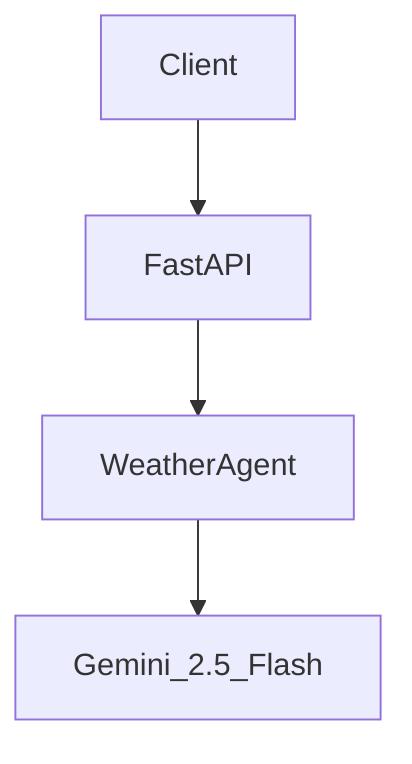
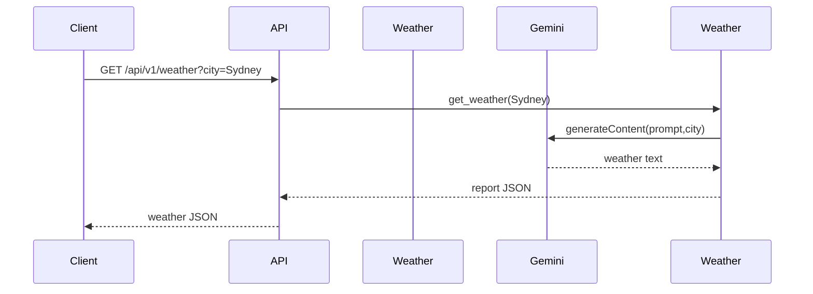

# 🌦️ Weather & Time Agent

An ultra-lightweight agent providing current weather (demo data) and accurate local time for any city worldwide. Perfect for enriching receipt or budgeting flows with contextual information.

## ✨ Features
- **Weather Reports**: Instant weather summary for popular cities (plug-n-play with OpenWeatherMap for real data).
- **Local Time**: Precise current time based on geocoding and the IANA timezone database.
- **Gemini-Powered Intelligence**: Uses Vertex AI `gemini-2.5-flash` to craft friendly, human-readable summaries.
- **Google ADK**: Built as a standalone ADK agent exposing two tools: `get_weather` and `get_current_time`.
- **Serverless Ready**: Designed to run on Cloud Run with zero state on disk; Firestore optional for caching.

## 🗺️ Architecture Overview


## 🔀 Sequence Diagram


## 🤖 LLM Call Profile
| Request | Model | Tokens In | Tokens Out |
|---------|-------|-----------|------------|
| Weather or Time query | gemini-2.5-flash | ~400 | ≤128 |

## 🔧 Usage
Install dependencies:
```bash
pip install -r agents/weather_bot/requirements.txt
```
Programmatic example:
```python
from agents.weather_bot.agent import root_agent as weather_agent
print(weather_agent.get_weather('Mumbai'))
print(weather_agent.get_current_time('Tokyo'))
```

## ☁️ Deploy to Cloud Run (Quick Start)
```bash
gcloud run deploy weather-agent \
  --source agents/weather_bot \
  --memory 512Mi \
  --region us-central1 \
  --allow-unauthenticated
```

## 🛡️ Security Notes
- Store any OpenWeatherMap API key in Secret Manager and mount as env var `OPEN_WEATHER_KEY`.
- All external calls are performed over HTTPS; no user PII logged.

## 🏅 Hackathon Relevance
This agent demonstrates how small utility agents can be composed into a broader financial experience, showcasing the **agentic pattern** encouraged by the Google Cloud Generative AI Hackathon.